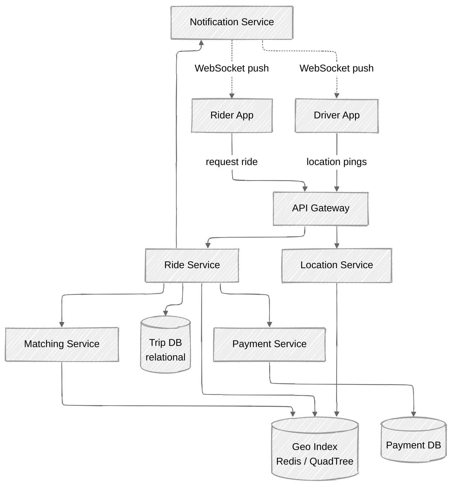

# 🚗 Uber — System Design

A design study of a ride-hailing platform: matching riders with nearby drivers in real time, tracking locations, and handling trip lifecycle, pricing, and payments at scale.

> Status: 🚧 In progress

---

## 1. Problem Statement

Design the backend for a ride-hailing service like Uber. A **rider** opens the app, requests a ride from their current location to a destination, and the system finds a nearby available **driver**, matches them, and tracks the trip from pickup to drop-off, ending with a fare and payment.

We focus on the core ride-matching and trip-tracking flow — the part that makes the system genuinely *hard* — rather than peripheral features such as Uber Eats, ratings, or marketing.

---

## 2. Functional Requirements

- A rider can request a ride from a pickup location to a destination.
- The system matches the request with the nearest suitable available driver.
- A driver can accept or decline a ride request.
- Both parties can see each other's live location during the trip.
- The system calculates the fare (with surge pricing when demand is high).
- The trip lifecycle is tracked: `requested → matched → en route → in progress → completed`.
- Payment is processed when the trip completes.

**Out of scope (for this study):** ratings & reviews, scheduled rides, pooling/UberX share, in-app chat, fraud detection.

---

## 3. Non-Functional Requirements

| Requirement | Target |
|-------------|--------|
| **Availability** | High — the service must be available 24/7; a failed match is a lost ride. |
| **Latency** | Matching should complete within a few seconds; location updates near real-time (< 1s). |
| **Consistency** | A driver must never be matched to two riders at once (strong consistency on matching). Location data can be eventually consistent. |
| **Scalability** | Tens of millions of users; high write throughput from continuous location pings. |
| **Durability** | Trip and payment records must never be lost. |

The key tension: **location updates are write-heavy and tolerant of staleness**, while **matching is correctness-critical**. These two concerns drive much of the architecture.

---

## 4. Scale Estimation

Rough back-of-the-envelope figures to size the system:

- **Active drivers:** ~1M concurrent during peak.
- **Location ping frequency:** every 4 seconds per active driver.
- **Location write QPS:** 1,000,000 / 4 ≈ **250,000 writes/sec** — the dominant load.
- **Ride requests:** assume ~1M rides/hour at peak ≈ **~300 requests/sec**.
- **Storage (trips):** ~10M trips/day × ~1KB/record ≈ **10GB/day** → ~3.6TB/year for the hot trip data.

**Takeaway:** location ingestion dwarfs everything else by ~1000×. It needs its own write-optimised path and should not touch the same datastore as trip records.

---

## 5. API Design

A handful of core endpoints (REST for request/response, WebSocket for live updates):

```http
POST   /v1/rides                      # Rider requests a ride
       { pickup: {lat, lng}, destination: {lat, lng}, rider_id }
       → { ride_id, status: "requested", eta }

POST   /v1/rides/{ride_id}/accept     # Driver accepts a match
       { driver_id }
       → { status: "matched", rider, route }

POST   /v1/rides/{ride_id}/decline    # Driver declines → re-match
DELETE /v1/rides/{ride_id}            # Rider cancels

POST   /v1/drivers/{driver_id}/location   # Driver location ping (high frequency)
       { lat, lng, heading, timestamp }

GET    /v1/rides/{ride_id}            # Poll trip status & live location
```

Live tracking uses a **persistent WebSocket connection** rather than polling, pushing location and status changes to both apps.

> 📊 See the full ride lifecycle in the [sequence diagram](./diagrams/sequence-ride-flow.md).

---

## 6. High-Level Architecture



**Core components:**

- **API Gateway** — auth, rate limiting, routing; terminates WebSocket connections.
- **Location Service** — ingests the firehose of driver location pings, updates the geo index. Write-optimised and isolated from the trip path.
- **Geo Index** — a spatial index (e.g. Redis Geo, a QuadTree, or geohash buckets) answering "which drivers are near this point?" quickly.
- **Matching Service** — given a ride request, queries the geo index for candidates and selects the best driver.
- **Ride Service** — owns the trip lifecycle state machine and persists trips.
- **Notification Service** — pushes real-time updates to apps over WebSocket.
- **Payment Service** — fare calculation and payment processing on completion.

> 📊 For the full picture — connection fleet, regional sharding, pub/sub fan-out, and the isolated location firehose — see the [detailed architecture diagram](./diagrams/architecture.md).

---

## 7. Data Model

**Trips** (relational — needs transactions & strong consistency):

| Field | Type | Notes |
|-------|------|-------|
| `ride_id` | UUID (PK) | |
| `rider_id` | UUID | |
| `driver_id` | UUID | null until matched |
| `status` | enum | requested / matched / en_route / in_progress / completed / cancelled |
| `pickup` | point | |
| `destination` | point | |
| `fare` | decimal | computed on completion |
| `created_at` / `updated_at` | timestamp | |

**Driver location** (in-memory / Redis — ephemeral, high churn):

```
driver:{id} → { lat, lng, heading, status: available|busy, last_seen }
```

Stored in the **geo index keyed by location bucket**, not in a durable relational store — it changes every few seconds and only the latest value matters.

**Why split storage?** Trip records are low-volume, high-value, and need ACID guarantees → relational DB (sharded by `ride_id` or region). Location data is high-volume, low-value, and disposable → in-memory geo store.

---

## 8. Deep Dives

### 8.1 Geospatial indexing — "find nearby drivers"

The crux of matching. Naïvely scanning all drivers is `O(n)` per request — impossible at this scale. Options:

- **Geohash** — encode lat/lng into a string prefix; nearby points share prefixes. Bucket drivers by geohash and query neighbouring cells. Simple and Redis-native.
- **QuadTree** — recursively subdivide space; dense city centres get finer cells, sparse rural areas stay coarse. Adapts to driver density.
- **S2 / H3 (Uber's actual choice)** — hexagonal hierarchical grid; uniform neighbour distances, no edge-distortion problems that square grids have.

A query becomes: *map the rider's location to a cell, fetch drivers in that cell and its neighbours, filter by availability, rank by ETA.*

### 8.2 The matching algorithm

1. Rider request arrives → map pickup to geo cell.
2. Fetch available drivers in that cell + adjacent cells.
3. Rank by **estimated time of arrival** (road-network distance, not straight-line).
4. Offer the ride to the top driver; wait for accept (with timeout).
5. On decline/timeout → offer to the next candidate.
6. On accept → atomically mark driver `busy` and trip `matched`.

**Race condition:** two riders being offered the same driver. Solved by a **lock / atomic compare-and-set** on the driver's status when accepting — only one match wins.

### 8.3 Surge pricing

When demand (requests) outstrips supply (available drivers) in a region, multiply the base fare by a surge factor. Computed per geo region on a rolling window of the supply/demand ratio. Incentivises more drivers into hot zones and rations demand.

### 8.4 Handling the location firehose

250k writes/sec cannot hit a relational DB. Instead:

- Pings go to the **Location Service**, which writes only to the **in-memory geo index** (last-write-wins).
- No durability needed — a stale location self-corrects within seconds on the next ping.
- Optionally sample a fraction to a stream (Kafka) for analytics, decoupled from the live path.

---

## 9. Bottlenecks & Trade-offs

| Concern | Risk | Mitigation |
|---------|------|------------|
| Location write load | Overwhelms storage | Dedicated in-memory geo store; never touches trip DB. |
| Geo index hotspots | Dense city cells get hammered | Adaptive cells (QuadTree/H3) + sharding by region. |
| Matching races | Double-booked driver | Atomic CAS on driver status; single winner. |
| WebSocket scale | Millions of open connections | Horizontal connection-server fleet + pub/sub fan-out. |
| Single-region failure | Whole city goes down | Region-based sharding; failover to nearby region. |

**Key trade-off:** we deliberately accept **eventually-consistent, lossy location data** in exchange for the write throughput to handle the firehose — while keeping **strong consistency only where it matters** (matching and trip/payment records).

---

## 10. Future Improvements

- **ETA prediction with ML** — use historical traffic data rather than naive distance.
- **Ride pooling** — match multiple riders along a shared route (a hard optimisation problem).
- **Driver positioning** — predict demand and nudge idle drivers towards future hot zones.
- **Multi-region active-active** — for resilience and lower latency near borders.
- **Backpressure & graceful degradation** — shed load on the analytics path before the live path.

---

## 📎 References

- [Uber Engineering Blog — H3 spatial index](https://www.uber.com/en-GB/blog/h3/)
- See [`notes.md`](./notes.md) for scratch notes and open questions.
