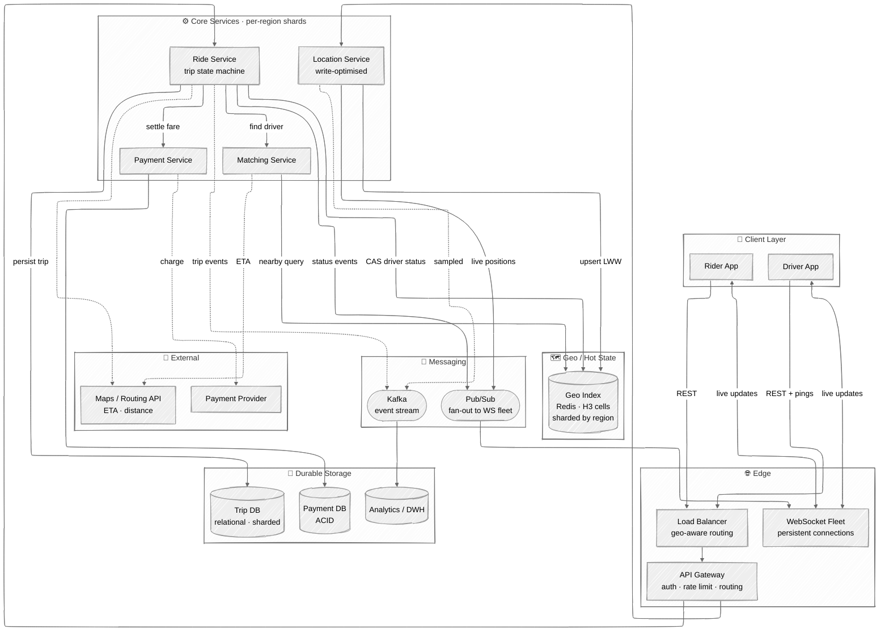

# Detailed Architecture Diagram

A more detailed view than the high-level diagram in the [main write-up](../README.md), showing the client layer, connection fleet, regional sharding, the isolated location firehose path, pub/sub fan-out, and the datastores.

## Reading the diagram

### The two paths
The design deliberately separates two very different workloads:

- **🔴 Hot path (location firehose):** `Driver App → LB → API Gateway → Location Service → Geo Index`. ~250k writes/sec, last-write-wins, in-memory, no durability. It never touches the relational databases.
- **🔵 Correctness path (trips & payments):** `Ride Service → Trip DB / Payment Service → Payment DB`. Low volume, ACID, sharded by region.

### Real-time delivery
The **WebSocket Fleet** holds millions of persistent connections. Services don't push to clients directly — they publish to **Pub/Sub**, which fans out to whichever connection server holds the target client's socket. This decouples the stateless core services from the stateful connection layer and lets each scale independently.

### Regional sharding
Core services and the Geo Index are **sharded by region** (city / metro area). A ride is local — a rider in London is never matched with a driver in Tokyo — so partitioning by geography keeps shards independent and enables regional failover.

### Analytics decoupling
**Kafka** carries a sampled copy of location data and all trip events to the data warehouse. This analytics path is fully decoupled from the live path, so it can lag or backpressure without affecting active rides.

### External dependencies
- **Maps / Routing API** — real road-network ETA and distance for ranking candidates and computing fares (straight-line distance is not good enough).
- **Payment Provider (PSP)** — the actual card charge, behind the Payment Service.
