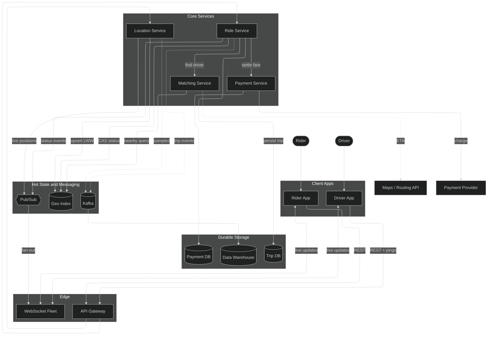
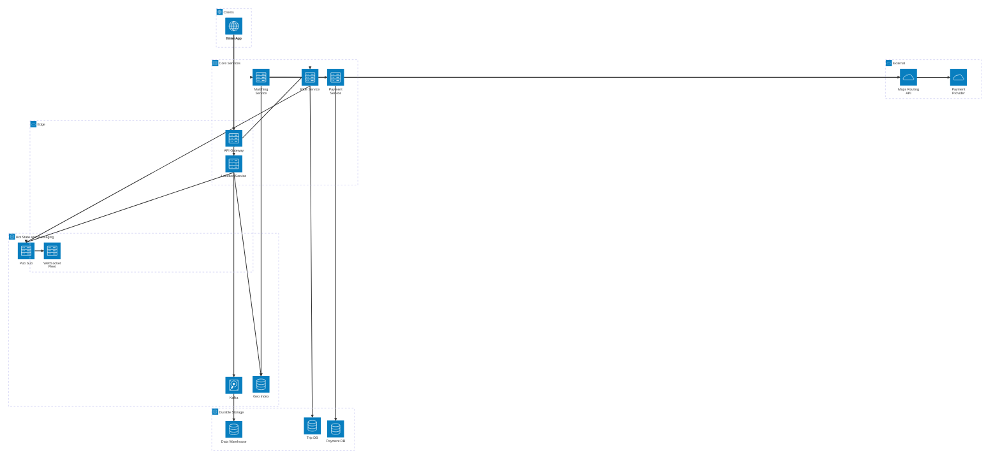

# Mermaid Style Comparison

Two ways to draw the Uber architecture, **both rendered natively by GitHub** (no images, no external services). Compare them and pick a favourite — we can then make it the canonical diagram.

---

## Style A — Flowchart with the **ELK layout engine**

Keeps every edge label and groups components into subgraphs. The `layout: elk` config produces tidier layering and far fewer crossing lines than the default engine.

> If the `layout: elk` line ever fails to render, delete the `config` front-matter block and it falls back to the default engine — the diagram still works.

---

## Style B — **`architecture-beta`** with service icons

Purpose-built for cloud/service architecture, with icons per node. Looks the most like a "real" architecture diagram. Trade-off: this diagram type **does not support edge labels**, so the relationship descriptions are dropped.

> `architecture-beta` needs a recent Mermaid version (11.1+). GitHub ships a current build, but if it does not render, Style A is the safe choice. Only the five built-in icons (`cloud`, `database`, `disk`, `internet`, `server`) are used, since custom icon packs require external loading that GitHub blocks.

---

## Quick comparison

| | Style A — ELK flowchart | Style B — architecture-beta |
|---|---|---|
| Edge labels | ✅ Yes | ❌ No |
| Icons | ❌ No | ✅ Yes |
| Layout quality | Very good (ELK) | Good, icon-led |
| Renderer requirement | Modern Mermaid | Mermaid 11.1+ |
| Best for | Detailed, annotated views | Clean visual overview |
