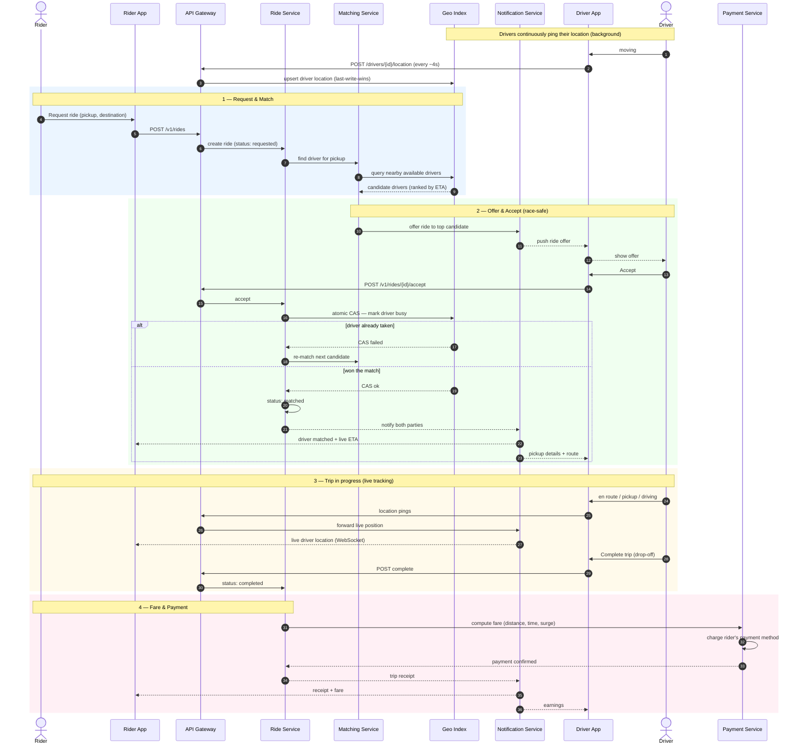

# Sequence Diagram — Ride Lifecycle

The end-to-end flow of a single ride, from request to payment. Renders inline on GitHub.

## Notes on the flow

- **Background location pings** (steps before the request) run continuously and independently — they keep the geo index fresh so matching has data to query.
- **The atomic CAS** (compare-and-set) on the driver's status is what prevents the same driver being double-booked. The `alt` branch shows the loser of a race falling back to re-matching.
- **Live tracking** during the trip flows over the WebSocket held open by the Notification Service, not by polling.
- **Payment** happens only on completion, as a distinct step the Ride Service orchestrates.
