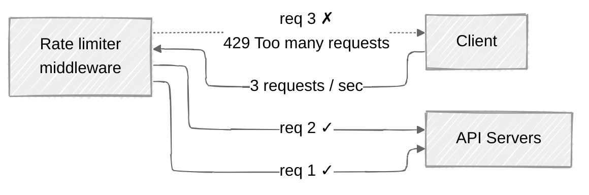
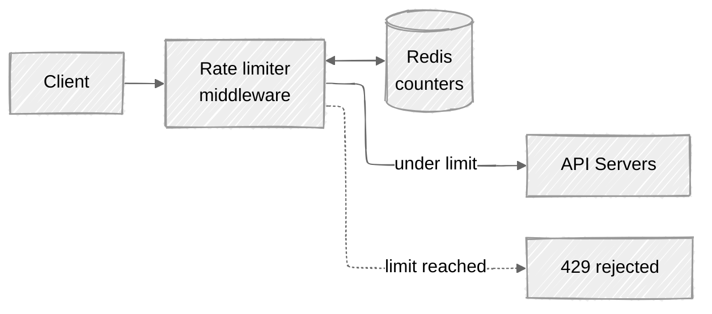
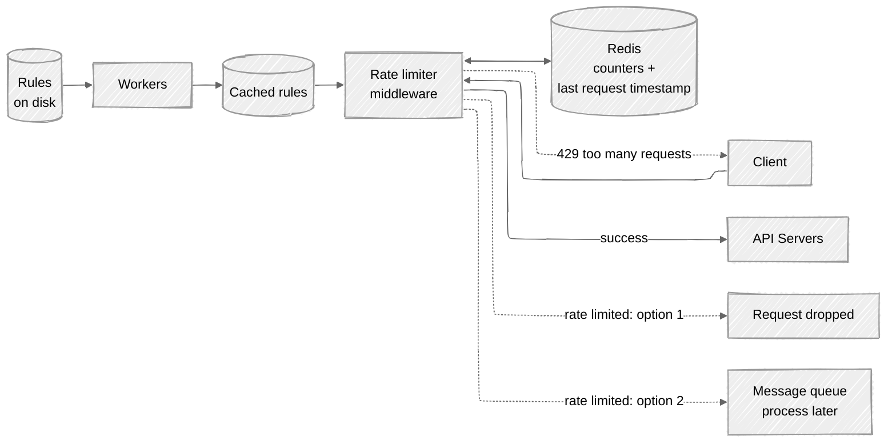
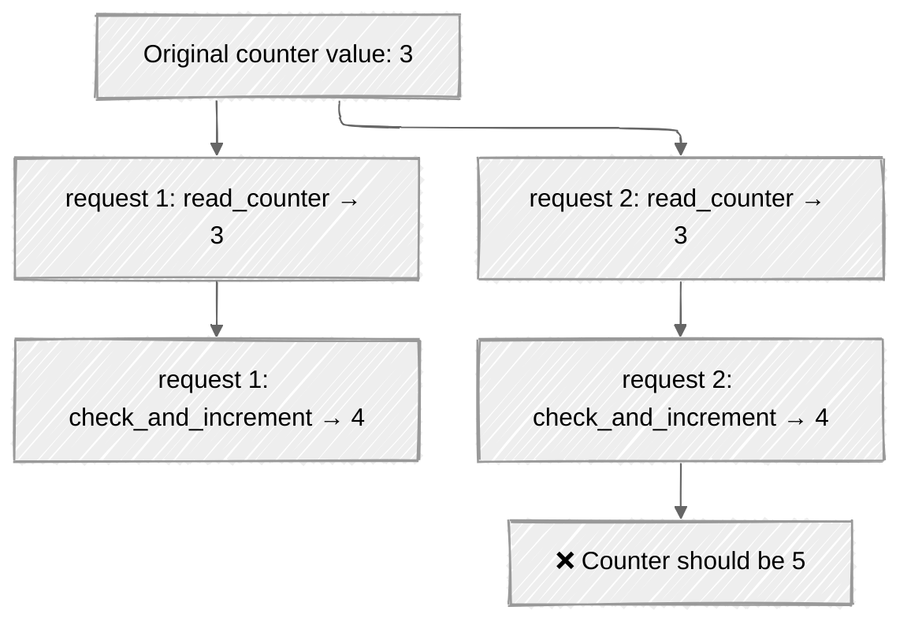
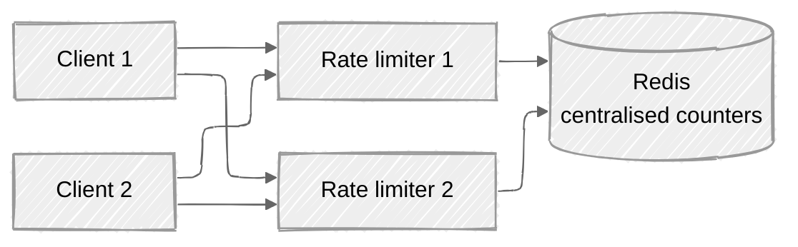

# 🚦 Rate Limiter — System Design

A design study of a **server-side API rate limiter**: a component that caps how many requests a client may send over a given period, and rejects the excess.

Based on **Chapter 4, "Design a Rate Limiter"** of *System Design Interview – An Insider's Guide* (Alex Xu), with a few clearly-marked additions of my own.

> Status: ✅ Complete — [try the simulator live ↗](https://rate-limiter.mhayk.workers.dev/)
>
> Four questions I left open are parked at the end of [`notes.md`](./notes.md). They are curiosities beyond the chapter, not gaps in it.

---

## 1. Problem Statement

In a network system, a rate limiter controls the rate of traffic sent by a client or a service. In the HTTP world, it limits the number of client requests allowed over a specified period; once the request count exceeds the configured threshold, the excess calls are blocked.

Typical rules look like:

- A user can write no more than **2 posts per second**.
- You can create a maximum of **10 accounts per day** from the same IP address.
- You can claim rewards no more than **5 times per week** from the same device.

**Why bother?** The book gives three reasons:

| Benefit | Why it matters |
|---------|----------------|
| **Prevent resource starvation from DoS** | Blocks excess calls, intentional or unintentional. Twitter limits tweets to 300 per 3 hours; Google Docs APIs default to 300 per user per 60 seconds for read requests. |
| **Reduce cost** | Fewer servers, and more resources for high-priority APIs. Critical when you pay *per call* for third-party APIs (credit checks, payments, health records). |
| **Prevent server overload** | Filters out excess requests from bots or users' misbehaviour. |

### Interview scoping (the book's candidate/interviewer dialogue)

The candidate asks, and the interviewer answers:

- **Client-side or server-side?** → Server-side API rate limiter.
- **Throttle by IP, user ID, or other properties?** → Flexible enough to support **different sets of throttle rules**.
- **Scale?** → Must handle a **large number of requests**.
- **Distributed environment?** → **Yes**.
- **Separate service or in application code?** → A **design decision up to you**.
- **Do we tell throttled users?** → **Yes**.

---

## 2. Functional Requirements

- **Accurately limit excessive requests** against a configured threshold.
- Support **flexible rules** — throttle by IP, user ID, API endpoint, or any other property.
- **Exception handling** — show clear exceptions to users when their requests are throttled (HTTP `429` + headers).
- Rules are **configurable without a redeploy** (rules live in config files on disk).
- Rate-limited requests are either **dropped** or **enqueued for later processing**, depending on the use case (e.g. orders throttled due to system overload can be kept and processed later).

**Out of scope:** authentication, quota billing, bot detection, DDoS mitigation at the network edge (though see the OSI-layer note in §9).

---

## 3. Non-Functional Requirements

The book's requirement list, restated as targets:

| Requirement | Target |
|-------------|--------|
| **Low latency** | The limiter sits in the request path — it must not slow down HTTP response time. |
| **Memory efficiency** | Use as little memory as possible; one counter per client per rule is a lot of keys. |
| **Distributed** | The limiter can be **shared across multiple servers or processes**. |
| **High fault tolerance** | If the limiter has problems (e.g. a cache server goes offline), it **does not affect the entire system**. |
| **Accuracy** | Limit excessive requests accurately — but see the accuracy/memory trade-off in §8.2. |

The central tension: **accuracy vs memory vs latency**. Every algorithm in §8.2 is a different point on that triangle.

---

## 4. Scale Estimation

> ⚠️ **My own reasoning — the book does not give back-of-the-envelope numbers for this chapter.** The interviewer only says "the system must be able to handle a large number of requests". I derive a plausible envelope so the design has something concrete to size against.

Assume a mid-size API platform:

- **10M registered users**, ~1M daily active.
- **Peak API traffic:** 100,000 requests/sec.
- **Redis operations:** the limiter does roughly **1 read + 1 write per request** — or, better, **1 atomic round-trip** (Lua / `INCR`). So **~100k Redis ops/sec** at peak. A single Redis node handles ~100k+ simple ops/sec, so one node is borderline; shard by key for headroom.
- **Latency budget:** the limiter should add **< 1–2 ms p99**. That means a *single* co-located Redis round-trip — no chatty multi-command protocols across regions.
- **Memory for counters:**
  - Fixed / sliding window **counter**: ~2 counters per client per rule. 1M active clients × 5 rules × 2 counters × ~100 bytes ≈ **~1 GB**. Comfortable.
  - Sliding window **log**: one entry (~20 bytes in a Redis sorted set, plus overhead) *per request in the window*. At 100k req/s with a 1-minute window that is 6M live entries ≈ **hundreds of MB and growing with traffic, not with users** — the memory blow-up is real (see §8.2.4).
- **Rules:** low hundreds of rules, a few KB of YAML. They fit trivially in an in-process cache on every limiter node.

**Takeaway:** counters are cheap; *logs* are what cost you. And the limiter's cost scales with **request volume**, not user count — which is exactly backwards from most services.

---

## 5. API Design

> ⚠️ **My own reasoning — the book specifies no API surface**, only the HTTP response contract (`429` + headers). What follows is a sensible admin/enforcement API.

### 5.1 The enforcement contract (this part *is* from the book)

The limiter is transparent: clients call your normal APIs, and the limiter answers on the response.

**Allowed:**

```http
HTTP/1.1 200 OK
X-Ratelimit-Limit: 5
X-Ratelimit-Remaining: 3
```

**Throttled:**

```http
HTTP/1.1 429 Too Many Requests
X-Ratelimit-Limit: 5
X-Ratelimit-Remaining: 0
X-Ratelimit-Retry-After: 30
```

| Header | Meaning (book's wording) |
|--------|--------------------------|
| `X-Ratelimit-Remaining` | The remaining number of allowed requests within the window. |
| `X-Ratelimit-Limit` | How many calls the client can make per time window. |
| `X-Ratelimit-Retry-After` | The number of seconds to wait until you can make a request again without being throttled. |

The book is explicit: when a user has sent too many requests, a **`429 Too Many Requests`** error **and** `X-Ratelimit-Retry-After` are returned to the client.

### 5.2 Internal / admin API (my addition)

```http
GET    /v1/limits/{domain}                 # read the active rules for a domain
PUT    /v1/limits/{domain}                 # publish new rules (validated, then written to disk)
GET    /v1/limits/status?key=user:1234     # inspect a client's current counter state (debugging)
DELETE /v1/limits/status?key=user:1234     # reset a client's counter (support escape hatch)
```

If the limiter is a **separate service** rather than middleware, the hot path becomes an internal RPC:

```
ShouldAllow(descriptor) -> { allowed: bool, limit: int, remaining: int, retry_after_s: int }
```

Keep it a **single round-trip** and make it **fail-open** (see §10.1) — the limiter must never be the thing that takes the API down.

---

## 6. High-Level Architecture

### 6.1 Where do you put it?

Three options, per the book:

- **Client-side.** Generally an *unreliable* place to enforce limits: client requests can easily be forged by malicious actors, and you may not control the client implementation at all.
- **Server-side.** The limiter lives with the API servers.
- **Middleware.** A rate limiter middleware sits *in front of* the API servers and throttles requests before they reach them. In a cloud-microservices world this is usually the **API gateway** — a fully managed middleware that supports rate limiting, SSL termination, authentication, IP whitelisting, serving static content, etc.



*The book's Figure 4-3: the API allows 2 requests per second; the client sends 3 in one second; the third is throttled with a `429`.*

**Server-side or gateway?** The book refuses a universal answer — "it depends on your company's current technology stack, engineering resources, priorities, goals" — and offers guidelines:

- Evaluate your **current tech stack**: is your language efficient enough to implement rate limiting server-side?
- Pick the **algorithm that fits your business needs**. Server-side gives you *full control* of the algorithm; a third-party gateway may limit your choice.
- If you **already use microservices** and an API gateway for auth/IP-whitelisting, adding rate limiting there is natural.
- Building your own rate limiting service **takes time**. Without the engineering resources, a **commercial API gateway is the better option**.

### 6.2 The basic mechanism

At a high level, we need a **counter** tracking how many requests came from the same user/IP. If the counter exceeds the limit, the request is disallowed.

**Where do the counters live?** *Not* a database — disk access is too slow. Use an **in-memory cache**: fast, and it supports time-based expiry. Redis is the popular choice, offering two commands that are all you strictly need:

- **`INCR`** — increases the stored counter by 1.
- **`EXPIRE`** — sets a timeout on the counter; when it expires the counter is deleted automatically.

The flow (book's Figure 4-12):



1. The client sends a request to the rate limiter middleware.
2. The middleware fetches the counter from the corresponding bucket in Redis and checks whether the limit is reached.
3. **Limit reached** → the request is rejected.
4. **Limit not reached** → the request is sent to the API servers; meanwhile the system increments the counter and saves it back to Redis.

> 📊 The full picture — rules on disk, workers, cached rules, the drop-vs-enqueue fork — is in the [architecture diagram](./diagrams/architecture.md).

---

## 7. Data Model

### 7.1 Rules (on disk, cached in memory)

Rules are generally **written in configuration files and saved on disk**. Lyft open-sourced their rate-limiting component, and the book shows its config shape:

```yaml
domain: messaging
descriptors:
  - key: message_type
    Value: marketing
    rate_limit:
      unit: day
      requests_per_unit: 5
```

*A maximum of **5 marketing messages per day**.*

```yaml
domain: auth
descriptors:
  - key: auth_type
    Value: login
    rate_limit:
      unit: minute
      requests_per_unit: 5
```

*Clients are **not allowed to log in more than 5 times in 1 minute**.*

The shape that matters: **domain → descriptor (key/value) → rate_limit (unit, requests_per_unit)**. A request is turned into one or more descriptors, each descriptor is looked up in the rule set, and *every* matching rule must pass.

### 7.2 Counters (Redis)

The state depends entirely on the algorithm chosen — which is the point of §8.2:

| Algorithm | Redis structure | Key shape (illustrative — my own naming) |
|-----------|-----------------|------------------------------------------|
| Token bucket | Hash / string | `tb:{client}:{rule}` → `{ tokens, last_refill_ts }` |
| Leaking bucket | List / queue | `lb:{client}:{rule}` → FIFO queue of pending requests |
| Fixed window | String counter | `fw:{client}:{rule}:{window_start}` → `int`, with `EXPIRE` |
| Sliding window log | **Sorted set** | `swl:{client}:{rule}` → members scored by timestamp |
| Sliding window counter | Two string counters | `swc:...:{prev_window}` and `swc:...:{curr_window}` |

The book explicitly notes that sliding-window-log timestamp data is **usually kept in cache, such as sorted sets of Redis**.

---

## 8. Deep Dives

### 8.1 Detailed design



*The book's Figure 4-13.*

- **Rules are stored on disk.** **Workers** frequently pull rules from disk and store them **in the cache**.
- A client request hits the **rate limiter middleware** first.
- The middleware **loads rules from the cache**, and **fetches counters and the last request timestamp from Redis**. Based on the response:
  - **Not rate limited** → forwarded to the API servers.
  - **Rate limited** → returns `429 Too Many Requests` to the client, and the request is **either dropped (option 1) or forwarded to a message queue (option 2)** to be processed later.

The enqueue option is not decoration: if some **orders** are rate limited due to system overload, you may want to **keep those orders to be processed later** rather than lose them.

### 8.2 The five algorithms

This is the heart of the chapter. Each has distinct pros and cons; understanding them is how you pick the right one — or the right *combination*.

> 🔬 **Run these yourself.** Every worked example below is reproduced in the simulator at [`./simulator/`](./simulator/) — zero dependencies, Node 22+ (TypeScript via native type stripping):
>
> ```bash
> npm run sim -- --list                 # list available scenarios
> npm run sim -- --scenario=<name>      # run one
> npm test                              # test suite reproducing the book's figures
> ```
>
> See [`./simulator/README.md`](./simulator/README.md) for the full scenario list.
>
> 🚦 **Or just open [rate-limiter.mhayk.workers.dev](https://rate-limiter.mhayk.workers.dev/)** — the visual version, with all five algorithms running against one live traffic stream. Hit *Boundary attack* to watch the fixed window let through twice its limit in real time.

---

#### 8.2.1 Token bucket

**Widely used**, simple, well understood. **Amazon and Stripe both use it** to throttle their API requests.

**Mechanism**

- A bucket is a container with a **pre-defined capacity**. Tokens are put in **at preset rates periodically**. Once the bucket is full, no more tokens are added — **extra tokens overflow**.
- **Each request consumes one token.** On arrival, check the bucket:
  - Enough tokens → take one out, request goes through.
  - Not enough tokens → the request is **dropped**.

**Parameters**

| Parameter | Meaning |
|-----------|---------|
| **Bucket size** | The maximum number of tokens allowed in the bucket. |
| **Refill rate** | Number of tokens put into the bucket every second. |

**Worked example (book's Figure 4-6 — bucket size 4, refill rate 4 per 1 minute)**

| Time | Bucket before | Requests | Outcome |
|------|---------------|----------|---------|
| 1:00:00 | 4 tokens | 1 | ✅ allowed — 1 token consumed |
| 1:00:05 | 3 tokens | 3 | ✅ all three allowed — 3 tokens consumed |
| 1:00:20 | 0 tokens | 1 | ❌ dropped |
| 1:01:00 | — | — | **4 tokens refilled** at the 1-minute interval |

*(Figure 4-4 illustrates the container itself with a different setting: capacity 4, refiller putting 2 tokens in every second; once full, extra tokens overflow.)*

**How many buckets do you need?** It depends on the rules:

- **Different buckets for different API endpoints.** If a user may make 1 post/sec, add 150 friends/day, and like 5 posts/sec → **3 buckets per user**.
- Throttling **by IP** → **one bucket per IP address**.
- A **global** limit (e.g. 10,000 requests/sec for the whole system) → **one global bucket** shared by all requests.

**Pros**

- Easy to implement.
- Memory efficient.
- **Allows a burst of traffic for short periods** — a request goes through as long as there are tokens left.

**Cons**

- Two parameters (bucket size and refill rate) — it **might be challenging to tune them properly**.

**When I'd pick it:** the sensible default for a public API. You want a steady average rate *and* tolerance for a client's legitimate burst (page load firing 10 calls at once). It is what Amazon and Stripe do, and the book itself recommends it in the monitoring section when a flash sale makes your limiter too tight: *"we may replace the algorithm to support burst traffic. Token bucket is a good fit here."*

---

#### 8.2.2 Leaking bucket

Similar to the token bucket **except that requests are processed at a fixed rate**. Usually implemented with a **FIFO queue**.

**Mechanism**

- A request arrives → check if the **queue is full**.
  - Not full → the request is **added to the queue**.
  - Full → the request is **dropped**.
- Requests are **pulled from the queue and processed at regular intervals**.

**Parameters**

| Parameter | Meaning |
|-----------|---------|
| **Bucket size** | Equal to the queue size. The queue holds the requests to be processed at a fixed rate. |
| **Outflow rate** | How many requests can be processed at a fixed rate, usually in seconds. |

**Worked example (my own, in the book's spirit)** — bucket size 3, outflow rate 1 request/second:

| Time | Event | Queue after | Outcome |
|------|-------|-------------|---------|
| 0.0s | 5 requests arrive at once | `[r1, r2, r3]` | r1–r3 queued; **r4, r5 dropped** (queue full) |
| 1.0s | leak | `[r2, r3]` | r1 processed |
| 2.0s | leak | `[r3]` | r2 processed |
| 3.0s | leak | `[]` | r3 processed |

The outflow is *perfectly smooth* — one per second — no matter how spiky the input. That is the whole point.

**Shopify, an ecommerce company, uses leaky buckets for rate limiting.**

**Pros**

- Memory efficient, given the limited queue size.
- Requests are processed at a **fixed rate** — suitable for use cases that need a **stable outflow rate**.

**Cons**

- **A burst of traffic fills up the queue with old requests**, and if they are not processed in time, **recent requests will be rate limited**.
- Two parameters again — **might not be easy to tune them properly**.

**When I'd pick it:** when the thing downstream physically cannot go faster — a payment provider that accepts 10 TPS, a legacy mainframe, a device driver. You care about the *shape* of the outflow, not just the count. Its failure mode (stale requests hogging the queue while fresh ones get dropped) makes it a poor fit for interactive user-facing APIs.

---

#### 8.2.3 Fixed window counter

**Mechanism**

- Divide the timeline into **fixed-size time windows** and assign a **counter for each window**.
- Each request **increments the counter by one**.
- Once the counter reaches the pre-defined **threshold**, new requests are **dropped until a new time window starts**.

**Parameters:** window size (the time unit) and the threshold (requests per window).

**Worked example 1 (book's Figure 4-8)** — time unit **1 second**, max **3 requests/sec**:

| Second | Requests received | Allowed | Dropped |
|--------|-------------------|---------|---------|
| 1:00:00 | 3 | 3 | 0 |
| 1:00:01 | 6 | 3 | 3 |
| 1:00:02 | 4 | 3 | 1 |
| 1:00:03 | 2 | 2 | 0 |
| 1:00:04 | 5 | 3 | 2 |

**Worked example 2 — the edge burst (book's Figure 4-9). This is the one to remember.**

The system allows **5 requests per minute**, and the quota **resets at the human-friendly round minute**.

- Five requests arrive between **2:00:00 and 2:01:00** — all allowed (window `2:00` counter → 5).
- Five more arrive between **2:01:00 and 2:02:00** — all allowed (window `2:01` counter → 5).
- But look at the **one-minute window from 2:00:30 to 2:01:30**: if the first five landed after 2:00:30 and the second five before 2:01:30, then **10 requests go through in a single rolling minute — twice as many as allowed.**

> ▶️ See it for yourself: `npm run sim -- --scenario=fixed-window-edge-burst`

**Pros**

- Memory efficient.
- Easy to understand.
- **Resetting the available quota at the end of a unit time window fits certain use cases** (e.g. "1000 API calls per calendar day" billing quotas).

**Cons**

- **A spike in traffic at the edges of a window could cause more requests than the allowed quota to go through.**

**When I'd pick it:** when the window is *semantically meaningful* — a daily quota that genuinely resets at midnight, a billing period — and the 2× boundary overshoot is acceptable. Also as a first implementation when `INCR` + `EXPIRE` is all you have.

---

#### 8.2.4 Sliding window log

Fixes the fixed window's edge problem.

**Mechanism**

- Keep track of **request timestamps**. Timestamp data is usually kept in cache, such as **Redis sorted sets**.
- When a new request comes in, **remove all outdated timestamps** — those older than the start of the current time window.
- **Add the timestamp of the new request to the log.**
- If the **log size is the same or lower than the allowed count**, the request is **accepted**. Otherwise it is **rejected**.

**Parameters:** window length, allowed count.

**Worked example (book's Figure 4-10 — allow 2 requests per minute)**

| # | Request at | Log after removing outdated + inserting | Log size | Outcome |
|---|-----------|------------------------------------------|----------|---------|
| 1 | **1:00:01** | `[1:00:01]` | 1 | ✅ allowed — the log was empty |
| 2 | **1:00:30** | `[1:00:01, 1:00:30]` | 2 | ✅ allowed — size 2, not larger than allowed count |
| 3 | **1:00:50** | `[1:00:01, 1:00:30, 1:00:50]` | 3 | ❌ **rejected** — size 3 > 2. **The timestamp stays in the log anyway.** |
| 4 | **1:01:40** | window is `[1:00:40, 1:01:40)`; `1:00:01` and `1:00:30` are outdated and removed → `[1:00:50, 1:01:40]` | 2 | ✅ allowed |

*(The book stores Linux timestamps in reality; the human-readable form is just for the example.)*

**Pros**

- **Very accurate.** In *any* rolling window, requests will not exceed the rate limit.

**Cons**

- **Consumes a lot of memory**, because **even if a request is rejected, its timestamp might still be stored** in memory.

**When I'd pick it:** when correctness beats cost — low-volume, high-value endpoints (login, password reset, payment initiation, expensive third-party calls). Never for a high-QPS public read endpoint: memory grows with *request volume*, including the requests you refuse.

---

#### 8.2.5 Sliding window counter

A **hybrid** of the fixed window counter and the sliding window log. The book explains one of two possible implementations (and points to reference [9] for the other).

**Mechanism**

Keep a counter for the **previous** window and the **current** window. For a request arriving partway through the current window, estimate the count in the rolling window:

```
requests in rolling window
  = requests in current window
  + requests in previous window × overlap % of the rolling window with the previous window
```

**Worked example (book's Figure 4-11 text)** — rate limit **7 requests/minute**:

- **5 requests in the previous minute**, **3 in the current minute**.
- A new request arrives at the **30% position** in the current minute → the rolling minute overlaps the previous minute by **70%**.
- Rolling count = **3 + 5 × 0.7 = 6.5** → the book **rounds it down to 6**. (Depending on the use case you may round up or down.)
- 6 < 7 → the request **goes through**. But the limit will be reached after **one more request**.

**Pros**

- **Smooths out spikes in traffic**, because the rate is based on the **average rate of the previous window**.
- **Memory efficient** — two counters per client, not a log.

**Cons**

- **Only works for a not-so-strict look-back window.** It is an **approximation**: it assumes requests in the previous window are **evenly distributed**.
- …but the book immediately softens this: **according to experiments done by Cloudflare, only 0.003% of requests are wrongly allowed or rate limited among 400 million requests.**

**When I'd pick it:** the best general-purpose choice for high-volume APIs. It costs the same as the fixed window, removes almost all of the boundary abuse, and the empirical error is negligible. It is what I would reach for when a token bucket's burst allowance is *not* wanted.

---

#### 8.2.6 Comparison

| Algorithm | Memory | Burst handling | Accuracy | Typical use |
|-----------|--------|----------------|----------|-------------|
| **Token bucket** | Low — 2 numbers per bucket (tokens, last refill) | **Allows bursts** up to bucket size, then throttles to the refill rate | Exact against its own definition (average rate + burst) | General-purpose public APIs where short bursts are legitimate. *Amazon, Stripe.* |
| **Leaking bucket** | Low — bounded queue | **Absorbs then smooths**; excess beyond queue size is dropped | Exact *outflow* rate; input burstiness is hidden | Protecting a downstream that needs a **stable outflow rate**. *Shopify.* |
| **Fixed window counter** | **Lowest** — 1 counter per window | Poor — **allows up to 2× the limit** across a window boundary | Weak at the edges, fine in the middle | Calendar-aligned quotas (daily/monthly), simplest possible implementation. |
| **Sliding window log** | **Highest** — one timestamp per request in the window, *including rejected ones* | Strictly enforced; no burst above the limit | **Highest** — never exceeds the limit in *any* rolling window | Low-volume, high-value endpoints: login, payments, expensive third-party calls. |
| **Sliding window counter** | Low — 2 counters | Smooths spikes via the previous window's average | Approximate (assumes even distribution), but **~0.003% error at 400M requests (Cloudflare)** | High-volume APIs wanting near-sliding accuracy at fixed-window cost. |

---

#### 8.2.7 What the simulator taught me that the chapter did not

> ⚠️ **My own findings.** These emerged from *implementing* the five algorithms and pointing traffic at them ([`./simulator/`](./simulator/)). None of them contradict the book; all of them are things the book's prose leaves you to discover.

**1. "Sliding window log uses a lot of memory" undersells the problem.** The book's rule is that a rejected request's timestamp is stored anyway. Follow that rule literally and a client sending at exactly its limit can be locked out *permanently*: every rejection appends a timestamp, the log never drains back below the limit, and the next request is rejected too. The fix is a boundary detail the book never has to confront — the rolling window must be **half-open**, `(t − w, t]`, so a request exactly `w` old ages out. Redis settles it for you: `ZREMRANGEBYSCORE` is inclusive of its max. Close the window at both ends instead and compliant traffic is refused forever. *(`npm test` pins this; the regression guard explains why.)*

**2. A client averaging well under its limit still gets throttled — and is not lying about it.** Run `steady-traffic` and then `poisson-traffic`: **identical mean rate** (~25 req/min against a limit of 30), the only difference being that arrivals are clumpy rather than metronomic. Under steady traffic every algorithm peaks at 24 and rejects nothing. Under Poisson arrivals, **four of the five deliver 34 requests in a rolling minute** — over the limit — while the sliding window log holds the line at exactly 30 by refusing 18 requests from a client sitting at 83% of quota. Random arrivals clump, and clumps breach a limit the average never approaches. There is no algorithm that is both exact *and* forgiving; that choice is a product decision, not a technical one.

**3. The leaking bucket's real cost is latency, not rejection.** The book says a burst "fills up the queue with old requests" and recent requests get limited. True, but the sharper version is what happens to the requests it *accepts*: in `leaking-bucket-starvation` the admitted requests wait an average of **27 seconds**, worst case **60 seconds**, behind a burst they had nothing to do with. Those are "successes" served long after the user gave up. **A fast `429` is often kinder than a slow `200`** — which is also the argument for why the token bucket, not the leaking bucket, is the default for user-facing APIs.

**4. The token bucket legitimately exceeds its own limit, and that is not a bug.** A bucket sized to the limit starts *full*, so in a rolling window it can spend its whole capacity *plus* whatever refills meanwhile — up to ~2× the nominal rate in the worst case. That is the burst allowance you asked for. If you need a hard ceiling in every rolling window, do not reach for a token bucket and then act surprised.

---

### 8.3 The distributed environment

Single-server rate limiting is easy. Multiple servers and concurrent threads bring **two challenges**.

#### 8.3.1 Race condition

The naive limiter does:

1. **Read** the `counter` value from Redis.
2. Check if `counter + 1` exceeds the threshold.
3. If not, **increment** the counter by 1 in Redis.



*The book's Figure 4-14.* If two requests concurrently read the counter (3) **before either writes back**, both increment to 4 and both believe they are correct. **The counter should be 5.** You have just leaked a request past the limit — and under real concurrency, many more than one.

**The solution — and the trap.** Locks are the *most obvious* solution, and the book rejects them outright: **locks will significantly slow down the system.** The two strategies actually used are:

- **Lua scripts** — the read-check-increment runs **atomically inside Redis**, in a single round-trip. No lock, no extra latency.
- **Sorted sets** — Redis's sorted-set data structure, as used by the sliding window log (the "rolling rate limiter" approach). The operations are atomic server-side.

> The lesson generalises: don't add a distributed lock around a data store that can already do the operation atomically for you. Move the *logic* to the data, not the data to the logic.

#### 8.3.2 Synchronisation issue

To support millions of users, **one rate limiter server is not enough**. With multiple limiter servers, synchronisation is required.

The web tier is **stateless**, so a client's requests can land on **any** limiter. If client 1 hits limiter 1 on one request and limiter 2 on the next, **limiter 1 has no data about the traffic limiter 2 saw** — and the rate limiter simply cannot work properly.



**The solution — and the second trap.** One possible fix is **sticky sessions**, pinning a client to the same limiter. The book is blunt: this **is not advisable, because it is neither scalable nor flexible**. The better approach is a **centralised data store like Redis**: the limiter servers stay stateless and *all* of them read and write the same counters.

> 📊 The race condition, the sticky-session anti-pattern, and the centralised-Redis fix are drawn out in the [distributed diagram](./diagrams/distributed.md).

### 8.4 Performance optimisation

Two areas the book calls out:

1. **Multi-data-centre / edge.** Latency is high for users far away from the data centre. Most cloud providers build many **edge server** locations worldwide — **as of 5/20/2020, Cloudflare had 194 geographically distributed edge servers**. Traffic is **automatically routed to the closest edge server** to reduce latency. Run the limiter at the edge, not just in one region.
2. **Eventual consistency.** Synchronise the counter data across regions with an **eventual consistency model** rather than trying to keep a globally strong-consistent counter. (Cross-referenced to the "Consistency" section of Chapter 6, Design a Key-value Store.)

The obvious consequence — **my own note** — is that a globally-enforced limit under eventual consistency is *approximate*: a client hammering several regions at once can briefly exceed the global limit before the counters converge. For rate limiting that is nearly always an acceptable trade; if it is not, you need a single authoritative region for that key, and you pay the latency.

### 8.5 Monitoring

After the limiter is live, gather analytics to check it is actually **effective**. Two things to verify:

- **The rate limiting algorithm is effective.**
- **The rate limiting rules are effective.**

Concretely:

- If the **rules are too strict**, many **valid requests get dropped** → relax the rules a little.
- If the limiter becomes **ineffective during a sudden traffic increase** (e.g. a **flash sale**) → the algorithm is wrong for the traffic shape. **Replace it with one that supports burst traffic — token bucket is a good fit here.**

**Metrics I would actually emit (my own addition):** allowed vs throttled counts per rule and per client class; `429` rate as a fraction of total traffic; p99 added latency of the limiter; Redis error/timeout rate (drives the fail-open path in §10.1); and the top-N throttled clients, so you can tell abuse from a badly-behaved integration.

---

## 9. Bottlenecks & Trade-offs

| Concern | Risk | Mitigation |
|---------|------|------------|
| **Redis is a single point of failure** | The limiter is in the request path; if Redis dies, does the API die? | **Fail open** (allow traffic when the limiter is unavailable) — the book's fault-tolerance requirement: a cache server going offline must not affect the entire system. Replicate Redis; shard by key. |
| **Added latency** | Every request pays a Redis round-trip | Co-locate Redis with the limiter; a **single atomic Lua round-trip**, not read-then-write. |
| **Race condition** | Concurrent read-check-increment leaks requests past the limit | **Lua script** or **Redis sorted sets** — *not* locks, which "significantly slow down the system". |
| **Synchronisation across limiter nodes** | Stateless web tier ⇒ a client's requests hit different limiters | **Centralised Redis** — *not* sticky sessions, which are "neither scalable nor flexible". |
| **Fixed-window edge burst** | Up to **2× the limit** across a boundary | Sliding window counter or sliding window log. |
| **Sliding window log memory** | Memory grows with *request volume*, including rejected requests | Use it only on low-volume, high-value endpoints; otherwise sliding window counter. |
| **Hot keys** | One abusive IP/user hammers one Redis key/shard | Shard by key; consider a local pre-filter / in-process token bucket in front of the shared counter. |
| **Global limits across regions** | Strong consistency worldwide is slow | **Eventual consistency** + edge deployment; accept approximate global enforcement. |

### The wrap-up talking points

The book ends with three extras worth raising if there is time:

**Hard vs soft rate limiting**

- **Hard:** the number of requests **cannot exceed** the threshold.
- **Soft:** requests **can exceed** the threshold for a **short period**.

**Rate limiting at different OSI layers.** This chapter only discusses rate limiting at the **application layer (HTTP: layer 7)**. It is possible to apply it at other layers — for example, limiting **by IP address using Iptables (IP: layer 3)**.
*(For reference, the OSI model's 7 layers: 1 Physical, 2 Data link, 3 Network, 4 Transport, 5 Session, 6 Presentation, 7 Application.)*

**Client best practices — how *not* to get throttled**

- Use a **client cache** to avoid making frequent API calls.
- **Understand the limit** and do not send too many requests in a short time frame.
- Include code to **catch exceptions or errors** so your client can gracefully recover.
- Add **sufficient back-off time** to your retry logic.

---

## 10. Future Improvements

### 10.1 Fail-open vs fail-closed (my own addition)

The book requires high fault tolerance but does not name the decision. **Fail open** (allow the request when Redis is unreachable) preserves availability and is right for the overwhelming majority of APIs — the limiter is a cost/abuse control, not a security boundary. **Fail closed** is right only where exceeding the limit is genuinely worse than an outage (e.g. a per-call-billed external API you must not overspend on). Decide it explicitly, and put a circuit breaker in front of Redis so a slow cache does not become a slow API.

### 10.2 Other directions

- **Per-tier limits** — free vs paid clients get different rules from the same rule engine.
- **Two-level limiting** — a cheap in-process token bucket to shed obvious abuse before it ever touches Redis, with the centralised counter as the source of truth.
- **Concurrency limits alongside rate limits** — see "Beyond the book".
- **Adaptive / dynamic limits** — tighten thresholds automatically when downstream latency rises (load shedding driven by health, not just a fixed number).
- **Prioritised queues** for the enqueue path, so throttled *orders* are retried before throttled *analytics pings*.

---

## 📌 Beyond the book

> Everything in this section is **my own addition** — accurate to my knowledge, but **not from Chapter 4**. Keep it separate when you recite the chapter.

**1. The `RateLimit-*` standard headers.** The book's `X-Ratelimit-Limit` / `X-Ratelimit-Remaining` / `X-Ratelimit-Retry-After` are the older, de-facto convention (the `X-` prefix for custom headers has been deprecated for new headers since RFC 6648). The IETF has since worked on a standard family — `RateLimit-Limit`, `RateLimit-Remaining`, `RateLimit-Reset` (plus a combined `RateLimit` field in later drafts) — designed to be interoperable across providers. Also note the **standard `Retry-After` header** (RFC 9110) already exists and is the correct thing to send with a `429`: the book's `X-Ratelimit-Retry-After` is essentially a vendor-prefixed twin of it. In an interview: mention the book's headers, then note that `Retry-After` is the standardised one.

**2. The sliding window counter *is* the Cloudflare approximation.** The `3 + 5 × 0.7` formula is exactly the weighted-average approximation Cloudflare describes in "How we built rate limiting capable of scaling to millions of domains" — which is also where the 0.003%-error-over-400M-requests figure the book cites comes from. They are the same idea, so if an interviewer names either one, you can connect them.

**3. GCRA — the leaky bucket as a *meter*.** The Generic Cell Rate Algorithm (from ATM networking, used today by libraries such as `throttled`) implements a leaky-bucket-shaped limit **without a queue**: instead of holding requests, it stores a single value — the "theoretical arrival time" (TAT) of the next permitted request. A request is allowed if now ≥ TAT − burst tolerance, and TAT advances by the emission interval. One number per client, O(1), no queue memory, and it naturally yields the exact wait time for a `Retry-After`. It behaves like a token bucket in what it permits, but is cheaper to store than either bucket. Worth naming if you are asked "can you do better than these five?".

**4. Rate limits vs concurrency limits.** A rate limit caps *requests per unit time*; a **concurrency limit** caps *requests in flight at once*. They protect against different failures: rate limits stop a client draining your quota; concurrency limits stop 100 simultaneous 30-second requests from exhausting your thread pool even though the *rate* is modest. Mature APIs enforce both. This is a genuinely strong point to raise in the "bottlenecks" phase, because the book's five algorithms cannot express it.

**5. Rate limiting is not DDoS protection.** A layer-7 limiter still has to *receive* and parse the request to reject it. Volumetric attacks must be dropped further out — layer 3/4, at the edge or by the network provider. The book gestures at this with the Iptables note; be able to say why the two live at different layers.

---

## 📎 References

The chapter's reference list ([full annotated version in `notes.md`](./notes.md)); the ones most worth reading:

- [Stripe — Scaling your API with rate limiters](https://stripe.com/blog/rate-limiters)
- [Cloudflare — How we built rate limiting capable of scaling to millions of domains](https://blog.cloudflare.com/counting-things-a-lot-of-different-things/) (source of the 0.003% figure)
- [Lyft — ratelimit (the YAML config in §7.1)](https://github.com/lyft/ratelimit)
- [ClassDojo — Better rate limiting with Redis sorted sets](https://engineering.classdojo.com/blog/2015/02/06/rolling-rate-limiter/)
- [Google Cloud — Rate-limiting strategies and techniques](https://cloud.google.com/solutions/rate-limiting-strategies-techniques)

**In this folder:**

- 📊 [Architecture diagrams](./diagrams/architecture.md) · [Algorithm diagrams](./diagrams/algorithms.md) · [Distributed diagrams](./diagrams/distributed.md)
- 🔬 [Simulator](./simulator/README.md) — run the book's figures yourself
- 🧠 [`notes.md`](./notes.md) — active-recall deck for interview prep
