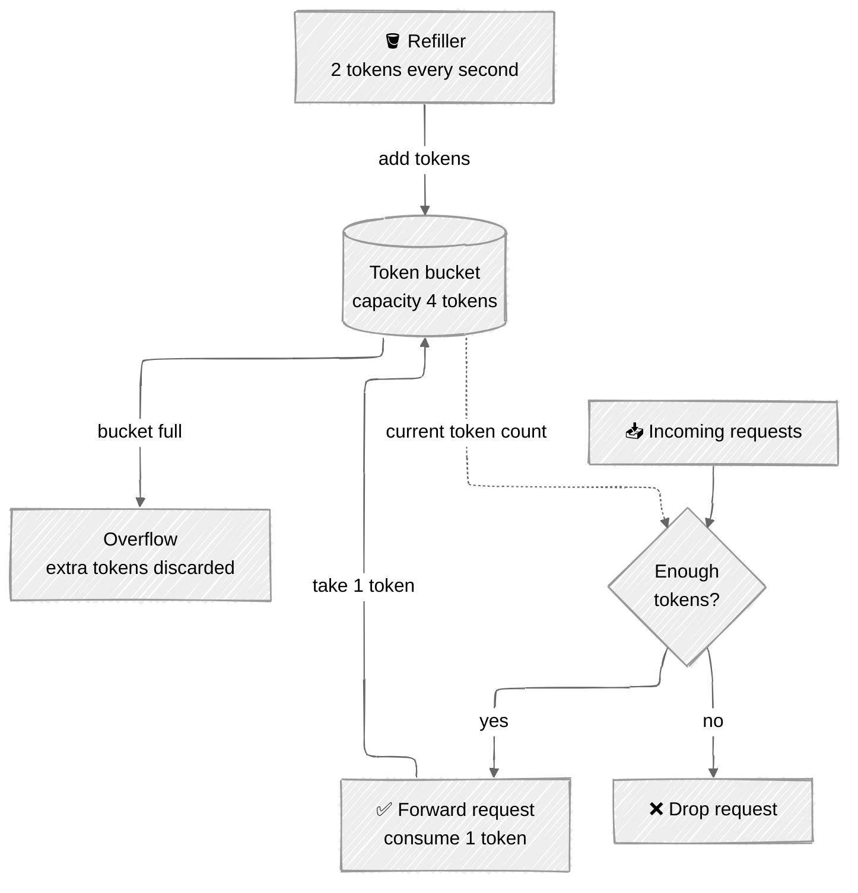
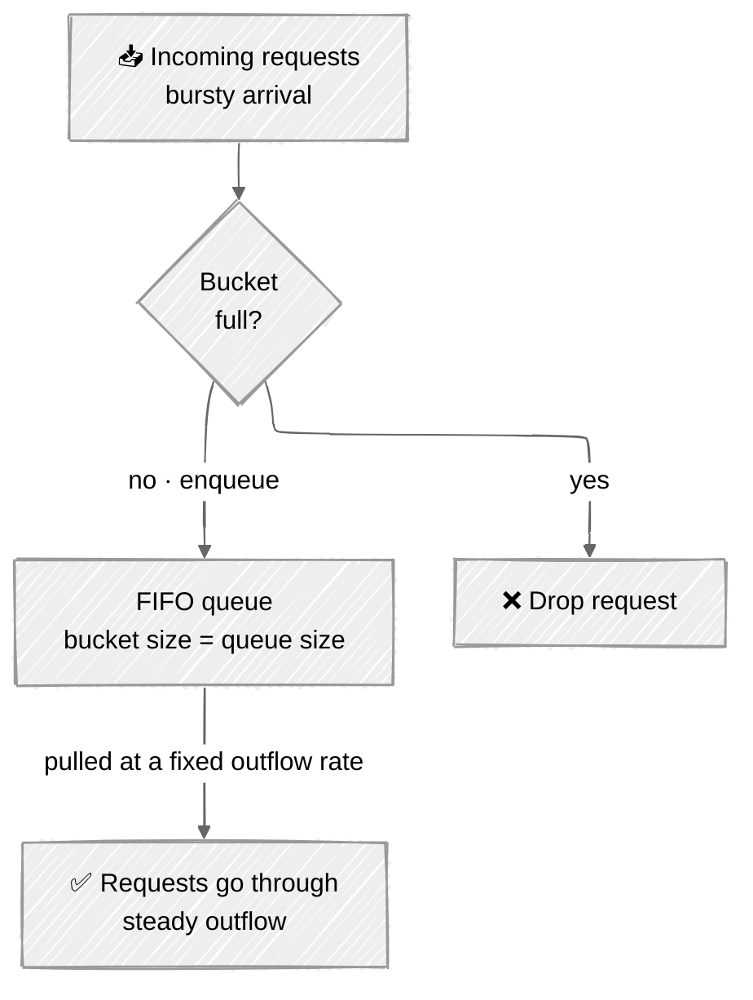
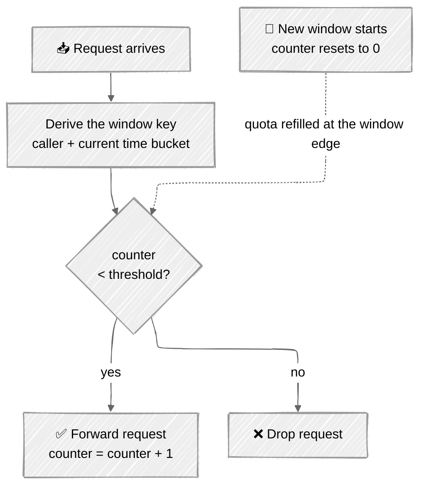
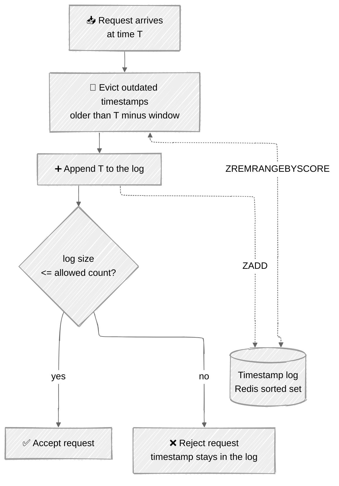
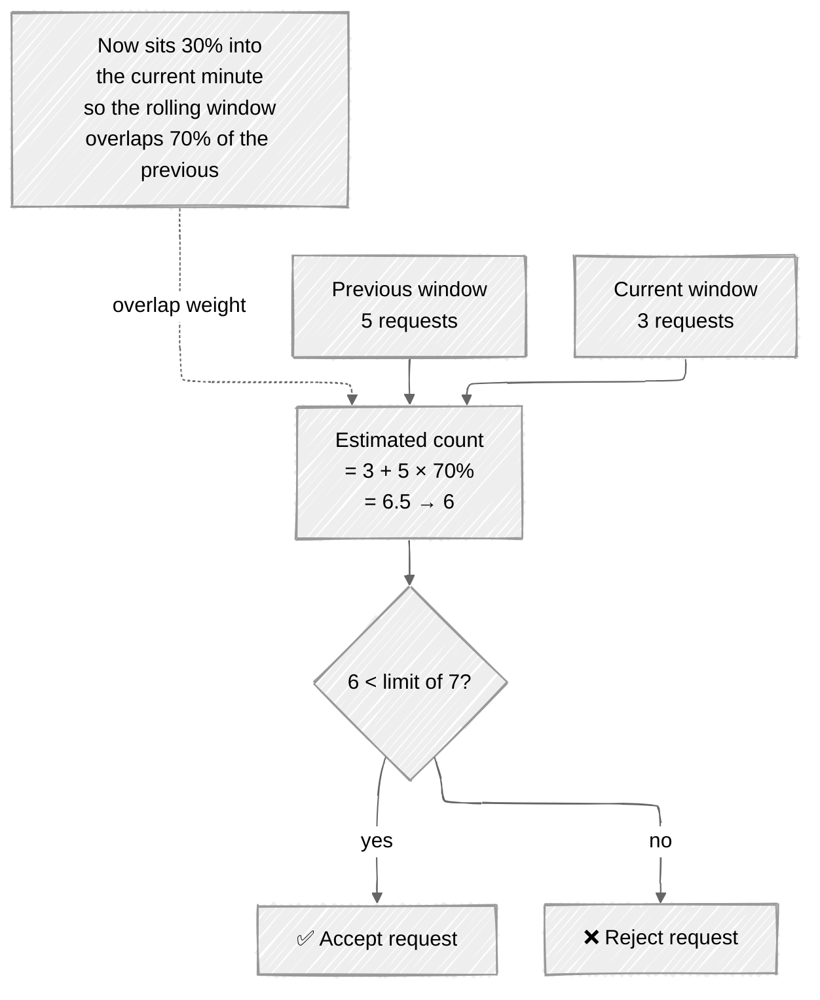

# Rate Limiting Algorithms

The five algorithms from Chapter 4, one section each: how the mechanism works, a worked example with the book's own numbers, and the trade-off that decides when you would pick it.

If you can re-derive all five from the pictures below, you know this chapter.

| Algorithm | One-line summary |
|---|---|
| [Token bucket](#1-token-bucket) | Tokens drip in; each request eats one. Allows bursts. |
| [Leaking bucket](#2-leaking-bucket) | A FIFO queue drained at a fixed rate. Smooths bursts. |
| [Fixed window counter](#3-fixed-window-counter) | A counter per clock window. Simple, but leaks at the edges. |
| [Sliding window log](#4-sliding-window-log) | Keep every timestamp. Exact, but memory-hungry. |
| [Sliding window counter](#5-sliding-window-counter) | Weighted blend of the previous and current window. The pragmatic compromise. |

---

## 1. Token bucket

A bucket holds tokens up to a fixed **capacity**. A **refiller** adds tokens at a preset rate; once the bucket is full, extra tokens **overflow** and are thrown away. Every request must consume one token — no token, no request.

In the book's figure the capacity is **4 tokens** and the refiller adds **2 tokens per second**.



### The timeline

Now with **bucket size 4** and **refill rate 4 per minute** — this is the book's consumption/refill walkthrough.

| Time | Tokens at start | Requests | Outcome | Tokens left |
|---|---|---|---|---|
| `1:00:00` | 4 | 1 | ✅ goes through, 1 token consumed | 3 |
| `1:00:05` | 3 | 3 | ✅✅✅ all three go through, 3 tokens consumed | 0 |
| `1:00:20` | 0 | 1 | ❌ dropped — the bucket is empty | 0 |
| `1:01:00` | 0 | — | 🔄 the refiller adds 4 tokens at the 1-minute interval | 4 |

**What to notice:** at `1:00:05` **three requests go through at once**. That is the defining property — a token bucket *permits bursts*, as long as tokens are banked. The bucket size caps the burst; the refill rate caps the long-run average.

**Parameters:** bucket size, refill rate.
**How many buckets?** Usually one per API endpoint per user (3 endpoints with different limits = 3 buckets per user), or one per IP address, or a single global bucket if the rule is simply "10,000 requests per second across the whole system".

| ✅ Pros | ❌ Cons |
|---|---|
| Easy to implement | Two parameters, and they can be hard to tune properly |
| Memory efficient | |
| Allows short bursts of traffic | |

> Used by Amazon and Stripe to throttle their API requests.

---

## 2. Leaking bucket

Almost the same as the token bucket, except requests are processed at a **fixed rate**. It is normally a FIFO queue: an arriving request is enqueued if there is room, and dropped if the queue is full. A separate consumer pulls requests off the queue at regular intervals.



**What to notice:** the outflow is *always* the same, however spiky the input. Contrast with the token bucket — the token bucket would let a burst straight through; the leaking bucket flattens it into a steady stream. That is the whole difference between the two, and it is the answer to "when would you pick one over the other".

**Parameters:** bucket size (= queue size), outflow rate.

| ✅ Pros | ❌ Cons |
|---|---|
| Memory efficient, given the limited queue size | A burst fills the queue with **old** requests; if they are not drained in time, **recent** requests get rate limited |
| Stable, fixed outflow rate — good where downstream needs a steady load | Two parameters, again not easy to tune |

> Used by Shopify for rate limiting.

---

## 3. Fixed window counter

Chop the timeline into fixed-size windows and give each window a counter. Every request increments it. Once it hits the threshold, new requests are dropped until the next window begins.



### Worked example — 3 requests per second

Each 1-second window allows at most 3 requests; anything extra in that window is dropped.

| Window | Requests received | ✅ Allowed | ❌ Rate limited |
|---|---|---|---|
| `1:00:00` | 3 | 3 | 0 |
| `1:00:01` | 6 | 3 | 3 |
| `1:00:02` | 4 | 3 | 1 |
| `1:00:03` | 2 | 2 | 0 |
| `1:00:04` | 5 | 3 | 2 |

### The flaw: the boundary burst

This is the point of the whole section. The limit is **5 requests per minute**, and the quota resets on the human-friendly round minute. A caller sends 5 requests just *before* `2:01:00` and 5 more just *after* it. Both windows are individually legal.

```text
  limit: 5 requests / minute · quota resets on the round minute

        window A (2:00:00 → 2:01:00)      window B (2:01:00 → 2:02:00)
        counter = 5  ✅ legal             counter = 5  ✅ legal
        ┌───────────────────────────┐   ┌───────────────────────────┐
        │                  ▓ ▓ ▓ ▓ ▓│   │▓ ▓ ▓ ▓ ▓                  │
        └───────────────────────────┘   └───────────────────────────┘
    ────┼───────────────────────────┼───┼───────────────────────────┼────▶
     2:00:00                      2:01:00                        2:02:00

                          ┌ ─ ─ ─ ─ ─ ─ ─ ─ ─ ─ ─ ─ ┐
                            2:00:30  ────►  2:01:30      one rolling minute
                          └ ─ ─ ─ ─ ─ ─ ─ ─ ─ ─ ─ ─ ┘
                                      ⚠️  10 requests
                                   twice the allowed quota
```

**What to notice:** in the rolling minute from `2:00:30` to `2:01:30`, **10 requests** got through against a 5-per-minute limit — **twice the quota**. The algorithm only ever counts against the *clock's* windows, never against the *caller's* window. Every remaining algorithm in this chapter exists to fix this.

| ✅ Pros | ❌ Cons |
|---|---|
| Memory efficient | A spike at the **edges of a window** lets through up to 2× the allowed quota |
| Easy to understand | |
| Resetting quota on a round unit of time suits some use cases | |

---

## 4. Sliding window log

The fix for the boundary burst: stop counting per clock window, and instead keep a **log of request timestamps** — typically a Redis sorted set. On every request, evict the timestamps that have fallen out of the window, append the new one, and compare the log size against the limit.



### Worked example — 2 requests per minute

| # | Request at | Log before | Evicted as outdated | Log after inserting | Size | Outcome |
|---|---|---|---|---|---|---|
| 1 | `1:00:01` | *empty* | — | `1:00:01` | 1 | ✅ allowed |
| 2 | `1:00:30` | `1:00:01` | — | `1:00:01`, `1:00:30` | 2 | ✅ allowed — size is not larger than 2 |
| 3 | `1:00:50` | `1:00:01`, `1:00:30` | — | `1:00:01`, `1:00:30`, `1:00:50` | 3 | ❌ **rejected** — size 3 > 2 |
| 4 | `1:01:40` | `1:00:01`, `1:00:30`, `1:00:50` | `1:00:01`, `1:00:30` — older than `1:00:40` | `1:00:50`, `1:01:40` | 2 | ✅ allowed |

**What to notice — two subtleties that interviewers probe:**

1. **The rejected timestamp stays in the log.** At step 3 the request is refused, but `1:00:50` remains stored. That is exactly why step 4 has to evict before it counts — and it is also why this algorithm burns memory even on traffic it rejects.
2. **The window slides with the request, not with the clock.** At `1:01:40` the window is `[1:00:40, 1:01:40)`. There is no boundary to exploit, so the burst from the fixed window counter is impossible here.

| ✅ Pros | ❌ Cons |
|---|---|
| **Very accurate** — in any rolling window, requests never exceed the rate limit | Consumes a lot of memory: even rejected requests keep a timestamp in memory |

---

## 5. Sliding window counter

A hybrid of the previous two: keep cheap per-window counters (fixed window), but estimate the rolling window by **weighting the previous window by how much of it still overlaps** (sliding window).

> **Requests in the rolling window = requests in the current window + requests in the previous window × the overlap percentage**

The book's example: the limit is **7 requests per minute**, the previous minute saw **5** requests, the current minute has seen **3**, and the new request arrives **30% into the current minute** — so the rolling minute still overlaps **70%** of the previous minute.

```text
  rate limit: 7 requests / minute                        ▲ now
                                                         │  (30% into the
  ┌───── previous minute ─────┬───── current minute ─────┼──── minute)
  │                           │                          │
  │      5 requests           │       3 requests         │
  │  ░░░░░░░░░░░░░░░░░░░░░░░░ │ ░░░░░░░░░░               │
  └───────────────────────────┴──────────────────────────┴─────────────
            ╰──── 70% ────────┴────── 30% ───────╯
                 └──────── rolling minute ───────┘

  estimate = 3 + (5 × 70%) = 3 + 3.5 = 6.5  →  rounded down to 6
  6 < 7  →  ✅ the request is allowed (but one more will hit the limit)
```



**What to notice:** the count is an **estimate**, not a fact. It assumes the 5 requests in the previous minute were *evenly distributed*, which they were not. That assumption is the entire cost of the algorithm — and it buys you two fixed-window counters instead of a full timestamp log.

Rounding is a choice: the book rounds `6.5` down to `6`.

| ✅ Pros | ❌ Cons |
|---|---|
| Smooths out spikes — the rate is based on the average of the previous window | Only an approximation: it assumes an even distribution in the previous window |
| Memory efficient | So it only works for a not-so-strict look-back window |

> Cloudflare measured this: across **400 million requests**, only **0.003%** were wrongly allowed or wrongly rate limited. In practice the approximation is not a problem.

---

## Choosing between them

| Algorithm | Accuracy | Memory | Bursts | Reach for it when… |
|---|---|---|---|---|
| **Token bucket** | Good | Low | **Allows** bursts | You want to tolerate short bursts — flash sales, bursty clients |
| **Leaking bucket** | Good | Low | **Smooths** bursts | Downstream needs a stable, fixed outflow rate |
| **Fixed window** | Weak at edges | Lowest | Leaks 2× at the boundary | Simplicity matters more than precision, and quota resetting on a round minute is a feature |
| **Sliding window log** | **Exact** | **High** | No leak | Accuracy is non-negotiable and you can pay for the memory |
| **Sliding window counter** | Approximate | Low | Smoothed | The default pragmatic pick — nearly exact, cheap |

**Hard vs soft limits** — worth naming in an interview: a **hard** limit means requests may never exceed the threshold; a **soft** limit lets them exceed it for a short period. And all of the above is layer-7 (HTTP) rate limiting — you *can* also limit at layer 3 by IP, with Iptables.
