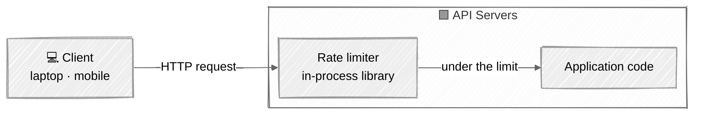
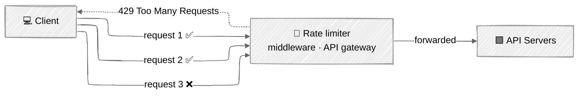
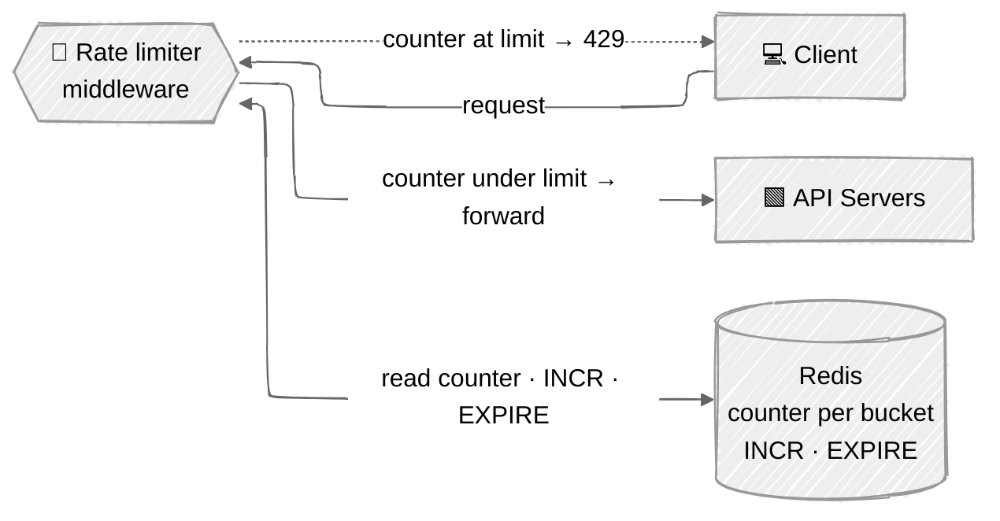
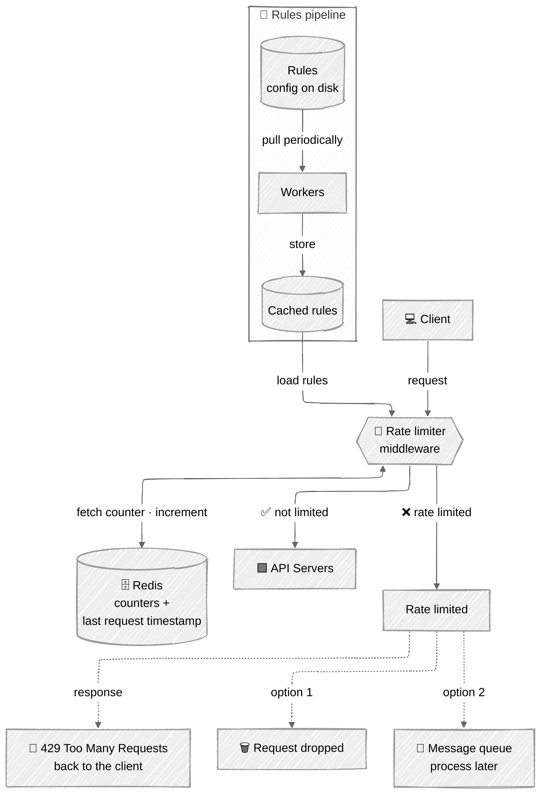
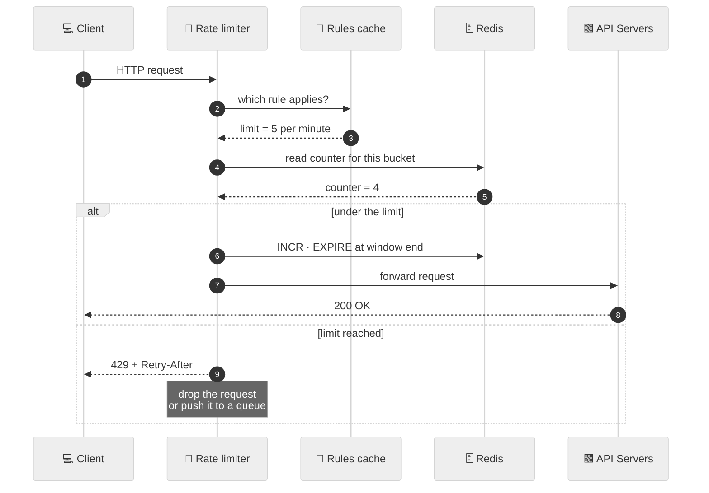

# Architecture Diagrams

Where the rate limiter lives, and what the system looks like once you zoom in. These redraw Figures 4-1, 4-2, 4-3, 4-12 and 4-13 of Chapter 4.

Read this file top to bottom: it goes from *"where do I even put this thing"* to the full production design.

---

## 1. Server-side rate limiter

The simplest option: the rate limiter is a library running inside the API servers themselves. The client-side alternative is a non-starter — client requests are trivially forged, and you may not control the client at all.



**What to notice:** the limiter is *inside* the trust boundary. You get full control over the algorithm, but every API server needs the library, and the excess traffic still reaches your servers before being rejected.

---

## 2. Rate limiter as middleware — and the 429

Instead of embedding the limiter, put it in front of the API servers as its own middleware. In cloud microservice stacks this is usually the **API gateway**, which already does SSL termination, authentication and IP whitelisting.

The example below is the book's: the API allows **2 requests per second** and the client fires **3** within one second.



**What to notice:** the first two requests are routed through; the third is throttled at the middleware and never touches an API server. The client gets **HTTP 429 Too Many Requests** — the status code that means "you have sent too many requests".

> **Server-side or gateway?** There is no absolute answer. Judge it on: your existing tech stack, whether your language can implement the algorithm efficiently, whether you already run an API gateway, and whether you have the engineering resources to build a limiter yourself. If you do not, a commercial gateway wins.

---

## 3. High-level architecture — where the counters live

The core idea of every algorithm is a **counter**. Storing counters in a database is too slow because of disk access, so we use an in-memory cache. **Redis** is the standard choice: it is fast and it offers exactly the two operations we need.

- `INCR` — increase the stored counter by 1.
- `EXPIRE` — set a timeout on the counter so it is deleted automatically when the window ends.



**What to notice:** the middleware is **stateless** — all the state sits in Redis. That single fact is what makes the design scale horizontally, and it is the answer to the synchronisation problem in [`distributed.md`](./distributed.md).

---

## 4. Detailed design

The high-level picture leaves two questions unanswered: *where do the rules come from?* and *what happens to a request that gets rate limited?*



**Rules** are written as configuration files and saved on disk. Workers pull them frequently and push them into the cache, so the middleware never touches the disk on the request path. A rule looks like this (the format is Lyft's open-sourced component):

```yaml
domain: auth
descriptors:
  - key: auth_type
    Value: login
    rate_limit:
      unit: minute
      requests_per_unit: 5
```

**What to notice — the two fates of a throttled request:**

- **Option 1 — drop it.** The default. The client gets a 429 and nothing else happens.
- **Option 2 — queue it.** Depending on the use case you may *enqueue* the rate-limited request and process it later. The book's example: orders that got throttled because of a system overload can be kept and processed once the load drops. The client still gets its 429; the work is not lost.

---

## 5. The request path, step by step

The same detailed design read as a sequence — this is the version to narrate out loud in an interview.



---

## 6. Rate limiter headers

How does a client know it is being throttled, and how much quota it has left? The limiter tells it, in the HTTP response headers.

| Header | Meaning |
|---|---|
| `X-Ratelimit-Limit` | How many calls the client may make per time window. |
| `X-Ratelimit-Remaining` | How many allowed requests are left in the current window. |
| `X-Ratelimit-Retry-After` | How many seconds to wait before requesting again without being throttled. |

**What to notice:** when a user has sent too many requests, they get a **429** *and* `X-Ratelimit-Retry-After`. A well-behaved client reads that header and backs off rather than hammering the API — which is the whole point of telling it.
