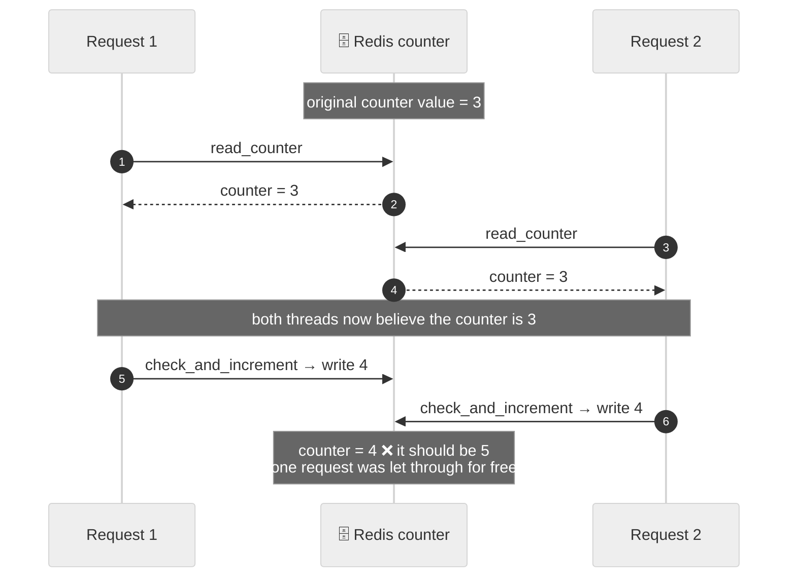
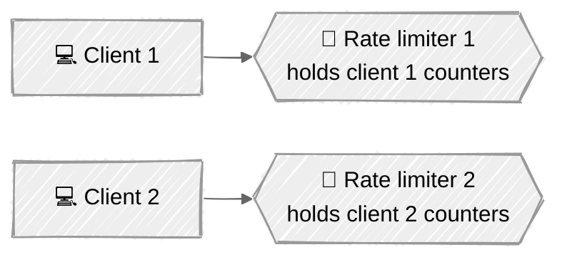
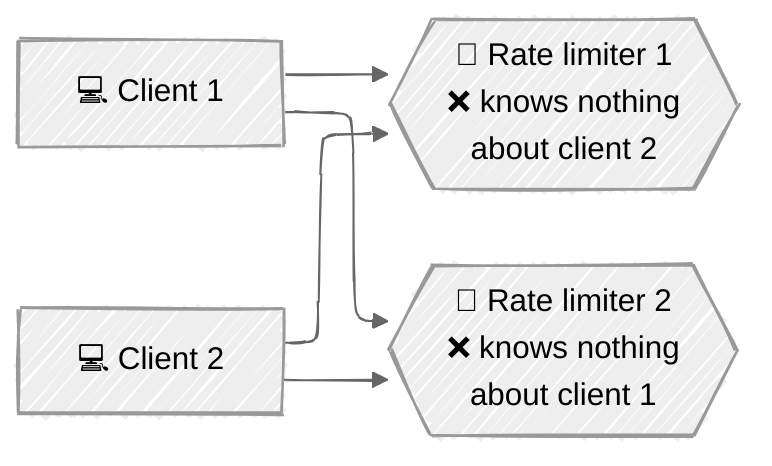
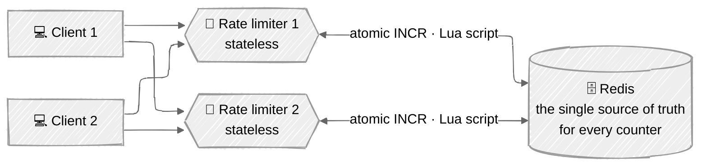
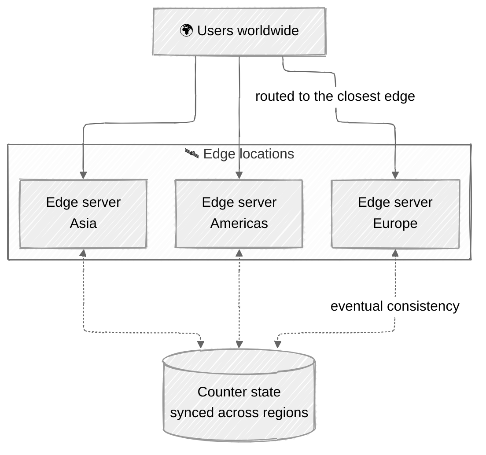

# The Distributed Environment

A rate limiter on a single server is easy. Scaling it to **multiple servers and concurrent threads** is where the interesting failures live. Chapter 4 names two, and both are worth being able to draw from memory:

1. **[Race condition](#1-the-race-condition)** — concurrent threads corrupt the counter.
2. **[Synchronisation issue](#2-the-synchronisation-issue)** — multiple limiter servers do not share state.

---

## 1. The race condition

At a high level the limiter does three things per request:

1. Read the `counter` value from Redis.
2. Check whether `counter + 1` exceeds the threshold.
3. If not, increment the counter by 1 in Redis.

That read-then-write is **not atomic**, and in a highly concurrent environment it breaks.

**What to notice:** both requests read `3` before either wrote back. Each incremented its own copy and wrote `4`. Two requests were served but the counter only moved by one — so the caller gets **one extra request for free**, every time this interleaving happens. Under real concurrency it happens constantly, and the limiter quietly under-counts.

### Fixing it

| Fix | Verdict |
|---|---|
| **Locks** | The obvious answer, and the wrong one — locks will **significantly slow down the system**. |
| **Lua script** | ✅ The read-check-increment runs inside Redis as one atomic unit. |
| **Redis sorted sets** | ✅ The natural fit for the sliding window log, and atomic. |

> "Locks are the most obvious solution — but locks will significantly slow down the system" is the sentence to have ready. The expected answer is a **Lua script** or **sorted sets**.

---

## 2. The synchronisation issue

One rate limiter server cannot serve millions of users, so you run several. The moment you do, they need to agree on the counters.

**What you might assume — each client always reaches the same limiter:**

**What actually happens — the web tier is stateless, so clients land anywhere:**

**What to notice:** rate limiter 1 holds no data about client 2, and vice versa. A client whose requests are spread over *N* limiters can therefore consume roughly *N* times its quota. Without synchronisation, **the rate limiter simply cannot work**.

### The fix: a centralised data store

**Sticky sessions** — pinning a client to one limiter — would technically work, but it is **neither scalable nor flexible**, so it is not advisable. The better approach is to keep no state in the limiters at all and put every counter in a **centralised Redis**.

**What to notice:** this single move solves *both* problems at once. The limiters become stateless, so it no longer matters which one a request lands on (synchronisation ✅), and because Redis is now the one place the counter lives, the increment can be made atomic there (race condition ✅). Add limiter servers freely; they hold nothing worth losing.

---

## 3. Performance optimisation

Two improvements the chapter calls out.

### Multi-data-centre / edge

Latency is high for users far from the data centre. Cloud providers run **geographically distributed edge servers** — Cloudflare had 194 of them as of May 2020 — and traffic is automatically routed to the **closest** edge.

### Eventual consistency

Synchronise the data across those locations with an **eventual consistency model**. This is the deliberate trade: a strongly consistent global counter would mean a cross-region round trip on *every* request, which defeats the point of the edge. Rate limiting can tolerate being slightly stale — letting a handful of extra requests through is far cheaper than adding 150 ms to every call.

---

## 4. Monitoring

Once the limiter is live, gather analytics to confirm two things:

- **Is the algorithm effective?**
- **Are the rules effective?**

| Symptom | What it means | What to do |
|---|---|---|
| Many valid requests are being dropped | The rules are **too strict** | Relax the rules |
| The limiter is ineffective during a sudden traffic spike — e.g. a flash sale | The **algorithm** does not suit bursty traffic | Swap the algorithm — **token bucket** is a good fit, because it allows bursts |

**What to notice:** the second row is the payoff for [`algorithms.md`](./algorithms.md). Monitoring does not just tune numbers — it can tell you that you picked the wrong algorithm entirely.

---

## Advice for the client being limited

The flip side, and a nice thing to close on:

- Use a **client cache** to avoid making frequent API calls.
- **Understand the limit** and do not send too many requests in a short time frame.
- Catch exceptions so the client recovers **gracefully** from a 429.
- Add **sufficient back-off time** to the retry logic — and honour `X-Ratelimit-Retry-After`.
