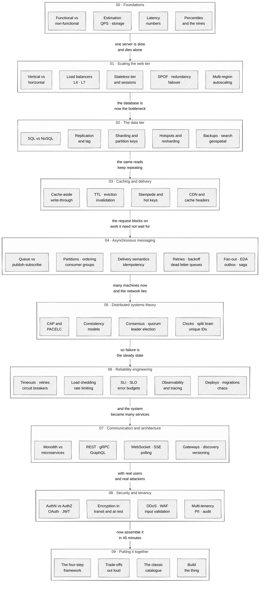

# 🧭 The System Design Map

Every topic worth knowing, on one page, arranged as a **journey** rather than a pile.

Most system design material is a list. A list tells you *what* exists; it does not tell you why one topic comes before another, or which five things you can safely postpone. This map is ordered so that **each stage answers a question the previous stage forced you to ask** — one server is slow, so you add servers; now the database is the bottleneck, so you replicate; now reads are repetitive, so you cache; now the request is blocking on work it need not wait for, so you go asynchronous; now there are many machines and the network lies, so you need theory.

**162 topics across 10 stages.** 112 are marked *core* — the first pass. The other 50 are marked ◇ *deep*: real, worth knowing, and safely postponed until the core is solid.

> **▶ [Open the interactive map ↗](https://roadmap.mhayk.workers.dev/)** — tick what you know, filter to what you don't, click any topic for what it is, the question it answers, and where it bites. Progress is saved in your browser.
>
> A single self-contained HTML file ([source](./index.html)), so it also opens straight from disk. Redeploy with
> `npx wrangler deploy --config wrangler.roadmap.jsonc` (see [`wrangler.roadmap.jsonc`](../../wrangler.roadmap.jsonc)).

---

## 🗺️ The whole thing in one picture

Read it top to bottom — that is the journey. Each stage exists because the one above it created a problem.

---

## 🚶 How to walk it

The map supports three different activities. They are not the same, and mixing them is why studying feels unproductive.

| Mode | What you do | Where |
|------|-------------|-------|
| **First pass** — learn the shape | Walk stages 00 → 09 in order, *core* topics only. Skip every ◇. You are building the skeleton, not the muscle. | Filter to **core** in the interactive map |
| **Second pass** — go deep | Return to the stages closest to your work and take the ◇ topics. Depth is worth more in two stages than breadth across ten. | Filter to **deep ◇** |
| **Review** — find the gaps | Read only the topic name, say the answer out loud, *then* open the detail to check. Tick what survives. | Filter to **still to learn** |

Two rules that make the difference:

1. **Attach every topic to a failure.** You do not understand a load balancer until you can say what breaks without one. Each topic in the interactive map carries a *where it bites* note for exactly this reason — that is the part you are actually learning.
2. **Build one thing per stage.** Reading about an algorithm and implementing it are different activities, and the second is where the misunderstandings surface. The rate limiter simulator in this repository contradicted the book twice.

---

## 00 · 🧱 Foundations

> Before a single box is drawn: **what** are we building, and **how big** is it?

The stage everyone skips and every interview grades. The output is not a design — it is a bounded problem with numbers attached. Non-functional requirements, not features, are what decide the architecture: "highly available *and* strongly consistent" is a request to pick one, and you can only push back once you have written the numbers down.

- [ ] Functional requirements
- [ ] Non-functional requirements
- [ ] Scoping questions
- [ ] Back-of-the-envelope estimation → [the reference](../estimation/) · [live calculator ↗](https://estimation.mhayk.workers.dev/estimator/)
- [ ] Latency numbers
- [ ] Throughput vs latency
- [ ] Percentiles: p50, p95, p99
- [ ] Availability and the nines
- [ ] DAU, peak factor, read:write ratio
- [ ] ◇ Cost as a design constraint

**Move on when** you can turn "design Twitter" into five clarifying questions, a QPS figure and a storage figure, in two minutes, out loud.

---

## 01 · 📈 Scaling the web tier

> One server is answering everything. It is **slow**, and if it dies **everything** dies. Now what?

Two problems that look like one: capacity and survival. Adding servers solves capacity and forces statelessness on you; the load balancer solves distribution and immediately becomes the new single point of failure. Almost every idea here is a variation on *what in this diagram exists exactly once?*

- [ ] Client–server model
- [ ] DNS and GeoDNS
- [ ] Vertical vs horizontal scaling
- [ ] Load balancer
- [ ] L4 vs L7 load balancing
- [ ] Balancing algorithms (round robin, least connections, IP hash)
- [ ] Consistent hashing
- [ ] Stateless web tier
- [ ] Session storage and affinity
- [ ] **Single point of failure (SPOF)**
- [ ] Redundancy and N+1
- [ ] Health checks and failover
- [ ] Active-active vs active-passive
- [ ] Multi-data-centre and multi-region
- [ ] Autoscaling
- [ ] ◇ Reverse proxy vs load balancer vs API gateway

**Move on when** you can point at any box in your own diagram and say what happens when it dies.

---

## 02 · 🗄️ The data tier

> The servers scale now. The **database** does not — one machine holds every row and every read.

The longest stage, because it is where the irreversible decisions live. Replication buys reads and survival; sharding buys writes and costs you joins, transactions and global uniqueness. The shard key is the most expensive decision in a design and the hardest to change — pick it from the dominant query, not the primary key.

- [ ] SQL vs NoSQL
- [ ] NoSQL families (key-value, document, wide-column, graph)
- [ ] OLTP vs OLAP
- [ ] Object, block and file storage
- [ ] Normalisation and denormalisation
- [ ] Indexes: B-tree vs LSM-tree
- [ ] Leader–follower replication
- [ ] Replication lag
- [ ] ◇ Multi-leader and leaderless replication
- [ ] ◇ Quorums (R + W > N)
- [ ] Sharding / partitioning
- [ ] Partition strategies (range, hash, directory, geo)
- [ ] Hotspots and the celebrity problem
- [ ] Resharding
- [ ] ◇ Cross-shard queries
- [ ] ◇ Secondary indexes when sharded
- [ ] ◇ Federation
- [ ] Backups, PITR and disaster recovery
- [ ] ◇ Retention, archival and tiering
- [ ] ◇ Search and the inverted index
- [ ] ◇ Time-series storage
- [ ] ◇ Geospatial indexing (geohash, quadtree) → [Uber](../../designs/01-uber/)
- [ ] ◇ Change data capture (CDC)

**Move on when** you can explain why you would replicate before sharding, and name three things sharding takes away from you.

---

## 03 · ⚡ Caching and delivery

> Reads outnumber writes 100 to 1. Why is the database **answering the same question** over and over?

The highest return per unit of effort in the whole map, and the one with the subtlest failure modes. Every cache is a second source of truth with no owner: the interesting problems are not hit rates but invalidation, the stampede when a hot key expires, and the single node that a single popular key can saturate.

- [ ] Why cache
- [ ] Cache-aside (lazy loading)
- [ ] Read-through
- [ ] Write-through, write-back, write-around
- [ ] TTL and expiry
- [ ] Eviction policies (LRU, LFU, FIFO)
- [ ] Cache invalidation
- [ ] Stampede / thundering herd
- [ ] Hot key problem
- [ ] Distributed cache
- [ ] ◇ Multi-tier caching
- [ ] ◇ Negative caching
- [ ] ◇ Bloom filter
- [ ] CDN and edge caching
- [ ] `Cache-Control`, ETag and revalidation
- [ ] ◇ Browser and client cache

**Move on when** you can describe what happens in the ten seconds after a popular key expires, and how you stop it.

---

## 04 · 📨 Asynchronous messaging

> The request is waiting on work it **doesn't need to wait for**. How do components stop blocking each other?

The stage that separates people who can draw an architecture from people who can operate one. Two shapes underlie everything: the **message queue** hands out *work* (one job, one worker) and **publish–subscribe** announces *facts* (one event, every interested party). Everything else — ordering, delivery semantics, retries, dead letter queues — is the consequence of putting a durable buffer between two systems that now fail independently.

Assume **at-least-once** delivery, because that is what you almost certainly have. Then idempotency stops being a nice-to-have and becomes the single most valuable habit in async design.

**The two shapes**
- [ ] Sync vs async
- [ ] Message queue (point-to-point)
- [ ] **Publish–subscribe**
- [ ] Queue vs topic: choosing between them
- [ ] Topics, partitions and consumer groups
- [ ] Broker landscape (Kafka, RabbitMQ, SQS/SNS, NATS)
- [ ] Producer/consumer decoupling

**Guarantees**
- [ ] Delivery semantics (at-most / at-least / exactly-once)
- [ ] Idempotency and dedup keys
- [ ] Message ordering and partition keys

**When it goes wrong**
- [ ] Backpressure and consumer lag
- [ ] Retries, backoff and jitter
- [ ] Dead letter queue (DLQ)
- [ ] ◇ Poison messages

**Patterns built on top**
- [ ] Fan-out: on write vs on read
- [ ] Job and task queues
- [ ] ◇ Delayed and scheduled messages
- [ ] Event-driven architecture
- [ ] ◇ Event sourcing
- [ ] ◇ CQRS
- [ ] ◇ Transactional outbox
- [ ] ◇ Saga pattern
- [ ] ◇ Stream vs batch processing
- [ ] ◇ Log retention and compaction
- [ ] ◇ Webhooks

**Move on when** you can say, without hesitating, what happens if a message is delivered twice — and what you did about it.

---

## 05 · 🧠 Distributed systems theory

> There are many machines now, and the network **lies**. What can still be guaranteed?

The stage that explains *why* the previous four had the trade-offs they had. It reads as abstract until you have been burnt: replication lag is a consistency model, split brain is a failure detector being wrong, and last-write-wins on wall clocks is a clock-skew bug that silently eats data.

- [ ] The fallacies of distributed computing
- [ ] CAP theorem
- [ ] ◇ PACELC
- [ ] ACID vs BASE
- [ ] Consistency models (strong, causal, eventual)
- [ ] Session guarantees (read-your-writes, monotonic reads)
- [ ] ◇ Linearisability vs serialisability
- [ ] ◇ Isolation levels
- [ ] ◇ Consensus: Paxos and Raft
- [ ] Leader election
- [ ] Quorum
- [ ] ◇ Two-phase commit
- [ ] ◇ Logical clocks (Lamport, vector)
- [ ] ◇ Clock skew and NTP
- [ ] Heartbeats and failure detection
- [ ] ◇ Split brain and fencing tokens
- [ ] ◇ Distributed locks
- [ ] Unique ID generation (Snowflake, UUID, ticket server)
- [ ] ◇ Gossip, anti-entropy and Merkle trees

**Move on when** you can say what CAP does *not* claim, and name the weakest consistency model a given feature could live with.

---

## 06 · 🛡️ Reliability engineering

> It works. Now: what happens when a **dependency** gets slow at 2am, and who finds out?

Failure is not an edge case, it is the steady state at scale. Three quiet defaults cause most cascading outages: no timeout, retries without backoff, and no way to shed load. Everything else here is about noticing (observability), committing (SLOs), and changing production without holding your breath.

**Surviving failure**
- [ ] Failure modes and blast radius
- [ ] Timeouts
- [ ] Retries and retry storms
- [ ] Circuit breaker
- [ ] ◇ Bulkheads
- [ ] Load shedding
- [ ] Rate limiting and throttling → [design 02](../../designs/02-rate-limiter/) · [live simulator ↗](https://rate-limiter.mhayk.workers.dev/)
- [ ] Graceful degradation

**Knowing about it**
- [ ] SLI, SLO, SLA and error budgets
- [ ] Observability: metrics, logs, traces
- [ ] Distributed tracing
- [ ] Alerting
- [ ] Capacity planning and load testing

**Changing it safely**
- [ ] Deployment strategies (blue-green, canary, feature flags)
- [ ] ◇ Zero-downtime schema migrations
- [ ] ◇ Chaos engineering
- [ ] ◇ Incident response and postmortems

**Move on when** you can name the three defaults above and say what each one does to a healthy system when its dependency slows down.

---

## 07 · 🔌 Communication and architecture

> The system is many services now. How do they **talk**, and where do the boundaries go?

Deliberately late in the journey, because microservices are an organisational answer to an organisational problem — and they trade an in-process call for a network call that can fail. Two services sharing one database are one service with extra latency.

- [ ] Monolith, modular monolith, microservices
- [ ] ◇ Service boundaries
- [ ] API gateway
- [ ] ◇ Backend for frontend (BFF)
- [ ] Service discovery
- [ ] ◇ Service mesh and sidecars
- [ ] REST
- [ ] ◇ GraphQL
- [ ] gRPC and protobuf
- [ ] WebSocket
- [ ] SSE, long polling and short polling
- [ ] Push vs pull
- [ ] Pagination (offset vs cursor)
- [ ] API versioning and compatibility
- [ ] ◇ Serialisation formats
- [ ] Idempotency keys at the boundary

**Move on when** you can pick between WebSocket, SSE and polling for a given feature and defend it in one sentence.

---

## 08 · 🔐 Security and tenancy

> Real users, real data, real attackers. Who is allowed to **see** and **do** what?

Cross-cutting rather than sequential — it applies to every stage above. The recurring design failure is checking identity at the edge and never checking permission at the service.

- [ ] Authentication vs authorisation
- [ ] Sessions vs tokens (JWT)
- [ ] OAuth 2.0 and OIDC
- [ ] ◇ Signed requests and API keys
- [ ] TLS and encryption in transit
- [ ] Encryption at rest and key management
- [ ] ◇ Secrets management
- [ ] DDoS protection and WAF
- [ ] Input validation and injection
- [ ] ◇ Multi-tenancy
- [ ] ◇ PII, GDPR and data residency
- [ ] ◇ Audit logs

**Move on when** you can answer "can you actually delete one user, everywhere?" — including caches, search indexes, backups and the warehouse.

---

## 09 · 🏁 Putting it together

> You know the parts. Can you **assemble** them, out loud, in 45 minutes?

The parts recombine. Once you have designed six of the classics, the seventh is mostly assembly — which is exactly when the assessment shifts from *what you know* to *what you choose and why*.

- [ ] The four-step framework (scope 5 → high level 15 → deep dive 15 → wrap up 5)
- [ ] Scope before depth
- [ ] Drawing the diagram
- [ ] Reasoning about trade-offs aloud
- [ ] Identifying bottlenecks
- [ ] The classic catalogue — URL shortener, chat, news feed, video, notifications, distributed cache, crawler, autocomplete, Drive, ticketing, payments
- [ ] Your own design catalogue → [the designs](../../designs/)
- [ ] ◇ Building the thing → [rate limiter simulator](../../designs/02-rate-limiter/simulator/)

---

## 🔗 Where this connects

| Stage | Goes with |
|-------|-----------|
| 00 Foundations | [📐 Estimation](../estimation/) — the toolkit for step 4 of every design |
| 02 Data (geospatial, matching) | [01 Uber](../../designs/01-uber/) |
| 06 Reliability (rate limiting) | [02 Rate limiter](../../designs/02-rate-limiter/) and its [simulator](../../designs/02-rate-limiter/simulator/) |
| 09 Practice | [All designs](../../designs/) |

---

## 📖 Where the material comes from

The spine is *System Design Interview* (Alex Xu, vols. 1–2), with the distributed-systems stage owing most to *Designing Data-Intensive Applications* (Martin Kleppmann) and the reliability stage to Google's *Site Reliability Engineering*. The ordering, the "where it bites" notes and the core/deep split are mine — that is the part that turns a list into a journey.

---

_Legend: ◇ = go deeper on the second pass. Everything else is the first pass._
